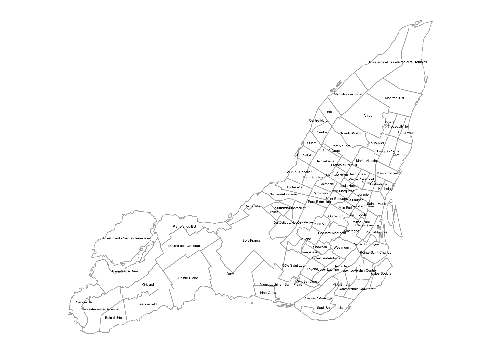
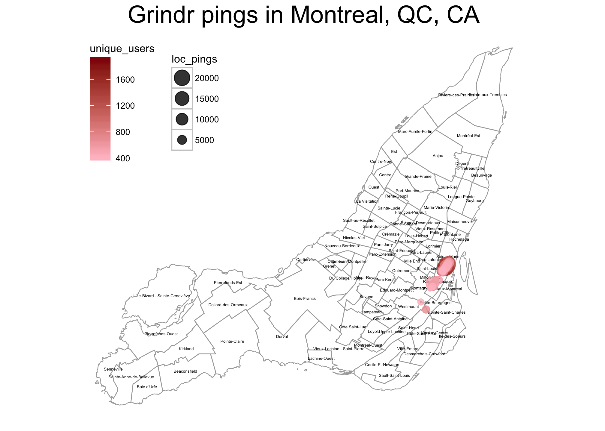

# Interactive and Static Mapping in R
Connor Gilroy  
`r Sys.Date()`  

## Outline

- Read Excel spreadsheet into R
- Convert geohash locations to latitude & longitude
- Filter data to look at one city
- Create interactive map using Leaflet
- (Create static map using shapefiles and ggplot2)

## Dataset

The dataset I'm using is from a gay mobile dating app, Grindr. Grindr made available a small set of aggregated, anonymized user data for a [hackathon](https://hack4equality2016-onlineonly.devpost.com/) in September 2016.

The data don't have much of a public description, but they appear to contain data for the top 100 locations in each of 15 cities. 


```r
library(readxl)
data_file <- "data/Data4Equality-Aug27.xlsx"
sheet_names <- excel_sheets(data_file)
sheet_names
```

```
##  [1] "LA"           "Sacramento"   "Puerto Rico"  "San Diego"   
##  [5] "St Louis"     "Nashville"    "Evansville"   "Ottawa"      
##  [9] "Calgary"      "Johannesberg" "Cape Town"    "Montreal"    
## [13] "Arequipa"     "Lima"         "Durban"
```

----


```r
library(magrittr)
library(dplyr)
grindr_df <- 
  lapply(sheet_names, function(x) read_excel(data_file, sheet = x)) %>%
  set_names(sheet_names) %>%
  bind_rows(.id = "city")
head(grindr_df[, 1:6])
```

```
## # A tibble: 6 × 6
##    city geohash8 unique_users loc_pings age_less_than_21 age_21_30
##   <chr>    <chr>        <dbl>     <dbl>            <dbl>     <dbl>
## 1    LA 9q5cfj59         2934     16884               62      1530
## 2    LA 9q5cfj5f         1963      8088               43       880
## 3    LA 9q5cfhdq         1943      9235               30       984
## 4    LA 9q5cfj58         1794      5936               41       947
## 5    LA 9q5cfhfe         1792      7657               52       907
## 6    LA 9q5cfj52         1662      6304               43       900
```

## Geohash to lat/lng

Geohash is a way of encoding location data. The more digits, the more precise the location. In this case, we have geohashes of length 8, with an error of ±0.019km. We can use a library to decode the geohashes into latitudes, longitudes, and errors for each.


```r
library(geohash)
grindr_df_locs <-
  grindr_df %>%
  bind_cols(., gh_decode(.$geohash8))
```

----


```r
grindr_df_locs %>% 
  select(geohash8, lat, lng, lat_error, lng_error) %>% 
  head()
```

```
## # A tibble: 6 × 5
##   geohash8      lat       lng    lat_error    lng_error
##      <chr>    <dbl>     <dbl>        <dbl>        <dbl>
## 1 9q5cfj59 34.08534 -118.3837 8.583069e-05 0.0001716614
## 2 9q5cfj5f 34.08551 -118.3834 8.583069e-05 0.0001716614
## 3 9q5cfhdq 34.08345 -118.3854 8.583069e-05 0.0001716614
## 4 9q5cfj58 34.08517 -118.3837 8.583069e-05 0.0001716614
## 5 9q5cfhfe 34.08431 -118.3851 8.583069e-05 0.0001716614
## 6 9q5cfj52 34.08517 -118.3840 8.583069e-05 0.0001716614
```

## Montreal

Let's look at one city, Montreal. Montreal has the second-highest number of Grindr users of the 15 cities in the dataset, after Los Angeles.


```r
montreal_grindr_df <- 
  grindr_df_locs %>% 
  filter(city == "Montreal")
```

## Bounding box with `sp`

Create a "bounding box" for the Montreal locations.


```r
library(sp)
```

```
## Loading required package: methods
```

```r
mtl_bb <- 
  montreal_grindr_df %>% 
  select(lng, lat) %>% 
  SpatialPoints(CRS("+proj=longlat")) %>%
  bbox()
mtl_bb
```

```
##           min       max
## lng -73.58591 -73.55192
## lat  45.48280  45.52279
```

## Map with Leaflet

`leaflet` is an R interface to the JavaScript Leaflet library, which creates interactive maps. 

First, create a base map.


```r
library(leaflet)
m <- 
  leaflet(montreal_grindr_df) %>% 
  fitBounds(lng1 = mtl_bb[1, 1],
            lat1 = mtl_bb[2, 1],
            lng2 = mtl_bb[1, 2],
            lat2 = mtl_bb[2, 2]) %>%
  addTiles()
```

----

<!--html_preserve--><div id="htmlwidget-d332982633009c1dd878" style="width:672px;height:480px;" class="leaflet html-widget"></div>
<script type="application/json" data-for="htmlwidget-d332982633009c1dd878">{"x":{"fitBounds":[45.4827976226807,-73.5859107971191,45.5227947235107,-73.5519218444824],"calls":[{"method":"addTiles","args":["http://{s}.tile.openstreetmap.org/{z}/{x}/{y}.png",null,null,{"minZoom":0,"maxZoom":18,"maxNativeZoom":null,"tileSize":256,"subdomains":"abc","errorTileUrl":"","tms":false,"continuousWorld":false,"noWrap":false,"zoomOffset":0,"zoomReverse":false,"opacity":1,"zIndex":null,"unloadInvisibleTiles":null,"updateWhenIdle":null,"detectRetina":false,"reuseTiles":false,"attribution":"&copy; <a href=\"http://openstreetmap.org\">OpenStreetMap\u003c/a> contributors, <a href=\"http://creativecommons.org/licenses/by-sa/2.0/\">CC-BY-SA\u003c/a>"}]}]},"evals":[],"jsHooks":[]}</script><!--/html_preserve-->

## Plot data

Then, add markers, sized by the number of unique users, with popups.


```r
library(stringr)
m_markers <- 
  m %>% 
  addCircleMarkers(radius = ~unique_users/100,
                   popup = ~str_c(as.character(unique_users), 
                                  "unique users", sep = " "), 
                   weight = 1, opacity = .5, fillOpacity = .5)
```

```
## Assuming 'lng' and 'lat' are longitude and latitude, respectively
```

----

<!--html_preserve--><div id="htmlwidget-b7c1293666a675ae2fbc" style="width:672px;height:480px;" class="leaflet html-widget"></div>
<script type="application/json" data-for="htmlwidget-b7c1293666a675ae2fbc">{"x":{"fitBounds":[45.4827976226807,-73.5859107971191,45.5227947235107,-73.5519218444824],"calls":[{"method":"addTiles","args":["http://{s}.tile.openstreetmap.org/{z}/{x}/{y}.png",null,null,{"minZoom":0,"maxZoom":18,"maxNativeZoom":null,"tileSize":256,"subdomains":"abc","errorTileUrl":"","tms":false,"continuousWorld":false,"noWrap":false,"zoomOffset":0,"zoomReverse":false,"opacity":1,"zIndex":null,"unloadInvisibleTiles":null,"updateWhenIdle":null,"detectRetina":false,"reuseTiles":false,"attribution":"&copy; <a href=\"http://openstreetmap.org\">OpenStreetMap\u003c/a> contributors, <a href=\"http://creativecommons.org/licenses/by-sa/2.0/\">CC-BY-SA\u003c/a>"}]},{"method":"addCircleMarkers","args":[[45.5209064483643,45.5193614959717,45.5210781097412,45.51833152771,45.5210781097412,45.5195331573486,45.5197048187256,45.5207347869873,45.518159866333,45.5203914642334,45.5174732208252,45.5178165435791,45.5198764801025,45.5205631256104,45.5190181732178,45.5152416229248,45.5176448822021,45.5226230621338,45.5200481414795,45.5224514007568,45.5176448822021,45.5191898345947,45.5202198028564,45.5167865753174,45.5185031890869,45.5191898345947,45.5154132843018,45.5186748504639,45.5173015594482,45.5152416229248,45.5188465118408,45.5212497711182,45.5160999298096,45.5198764801025,45.5207347869873,45.5185031890869,45.5193614959717,45.5154132843018,45.5195331573486,45.5154132843018,45.5162715911865,45.5166149139404,45.5209064483643,45.5152416229248,45.5150699615479,45.5157566070557,45.5166149139404,45.5164432525635,45.51833152771,45.5179882049561,45.4827976226807,45.5159282684326,45.5150699615479,45.5159282684326,45.521936416626,45.5150699615479,45.5188465118408,45.5222797393799,45.5023670196533,45.5224514007568,45.5044269561768,45.5080318450928,45.5224514007568,45.5150699615479,45.5173015594482,45.5227947235107,45.5202198028564,45.5179882049561,45.5148983001709,45.5171298980713,45.5047702789307,45.5155849456787,45.5155849456787,45.5075168609619,45.5197048187256,45.5221080780029,45.5205631256104,45.5200481414795,45.5212497711182,45.5154132843018,45.5178165435791,45.5226230621338,45.5203914642334,45.5203914642334,45.5154132843018,45.521764755249,45.5174732208252,45.5006504058838,45.5152416229248,45.4891490936279,45.5011653900146,45.518159866333,45.5155849456787,45.5008220672607,45.5169582366943,45.5021953582764,45.5147266387939,45.5155849456787,45.5152416229248,45.5148983001709],[-73.5539817810059,-73.5553550720215,-73.553638458252,-73.5563850402832,-73.5539817810059,-73.5553550720215,-73.5550117492676,-73.5539817810059,-73.5563850402832,-73.5543251037598,-73.557071685791,-73.5567283630371,-73.5550117492676,-73.5543251037598,-73.5556983947754,-73.5611915588379,-73.5567283630371,-73.5522651672363,-73.5546684265137,-73.5522651672363,-73.557071685791,-73.5556983947754,-73.5546684265137,-73.5577583312988,-73.5560417175293,-73.5553550720215,-73.5598182678223,-73.5560417175293,-73.557071685791,-73.5598182678223,-73.5556983947754,-73.553638458252,-73.5584449768066,-73.5546684265137,-73.5543251037598,-73.5563850402832,-73.5556983947754,-73.5591316223145,-73.5550117492676,-73.5594749450684,-73.5584449768066,-73.5581016540527,-73.553638458252,-73.5594749450684,-73.5611915588379,-73.5587882995605,-73.5577583312988,-73.5581016540527,-73.5560417175293,-73.5567283630371,-73.5797309875488,-73.5587882995605,-73.560848236084,-73.5584449768066,-73.5529518127441,-73.5598182678223,-73.5560417175293,-73.5526084899902,-73.571834564209,-73.5519218444824,-73.5714912414551,-73.568058013916,-73.5526084899902,-73.5594749450684,-73.5574150085449,-73.5522651672363,-73.5543251037598,-73.5563850402832,-73.5598182678223,-73.5574150085449,-73.5721778869629,-73.5591316223145,-73.5598182678223,-73.564624786377,-73.5553550720215,-73.5529518127441,-73.5539817810059,-73.5550117492676,-73.5539817810059,-73.5601615905762,-73.5563850402832,-73.5526084899902,-73.5539817810059,-73.5546684265137,-73.5611915588379,-73.553295135498,-73.5567283630371,-73.5749244689941,-73.560848236084,-73.5859107971191,-73.5721778869629,-73.5560417175293,-73.5587882995605,-73.5745811462402,-73.5574150085449,-73.571834564209,-73.5598182678223,-73.5594749450684,-73.5615348815918,-73.5594749450684],[19.73,18.79,18.68,18.05,17.77,16.28,15.48,15.35,15.12,14.16,14.05,13.9,13.48,13.04,13.01,12.51,12.33,12.18,11.94,11.65,10.48,10.48,10.14,9.99,9.96,9.94,9.92,9.74,9.72,9.45,9.37,9.21,8.92,8.65,8.56,8.25,8.12,7.82,7.64,7.46,7.46,7.42,7.26,7.19,7.16,7.05,6.88,6.88,6.88,6.84,6.82,6.79,6.67,6.67,6.48,6.4,6.4,6.38,6.35,6.23,6.22,6.2,5.98,5.78,5.76,5.76,5.73,5.63,5.62,5.55,5.45,5.44,5.42,5.41,5.35,5.14,5.05,5.05,5.01,4.96,4.82,4.77,4.56,4.52,4.49,4.42,4.38,4.33,4.32,4.3,4.24,4.23,4.16,4.13,4.11,4.1,4.04,3.99,3.97,3.97],null,null,{"lineCap":null,"lineJoin":null,"clickable":true,"pointerEvents":null,"className":"","stroke":true,"color":"#03F","weight":1,"opacity":0.5,"fill":true,"fillColor":"#03F","fillOpacity":0.5,"dashArray":null},null,null,["1973 unique users","1879 unique users","1868 unique users","1805 unique users","1777 unique users","1628 unique users","1548 unique users","1535 unique users","1512 unique users","1416 unique users","1405 unique users","1390 unique users","1348 unique users","1304 unique users","1301 unique users","1251 unique users","1233 unique users","1218 unique users","1194 unique users","1165 unique users","1048 unique users","1048 unique users","1014 unique users","999 unique users","996 unique users","994 unique users","992 unique users","974 unique users","972 unique users","945 unique users","937 unique users","921 unique users","892 unique users","865 unique users","856 unique users","825 unique users","812 unique users","782 unique users","764 unique users","746 unique users","746 unique users","742 unique users","726 unique users","719 unique users","716 unique users","705 unique users","688 unique users","688 unique users","688 unique users","684 unique users","682 unique users","679 unique users","667 unique users","667 unique users","648 unique users","640 unique users","640 unique users","638 unique users","635 unique users","623 unique users","622 unique users","620 unique users","598 unique users","578 unique users","576 unique users","576 unique users","573 unique users","563 unique users","562 unique users","555 unique users","545 unique users","544 unique users","542 unique users","541 unique users","535 unique users","514 unique users","505 unique users","505 unique users","501 unique users","496 unique users","482 unique users","477 unique users","456 unique users","452 unique users","449 unique users","442 unique users","438 unique users","433 unique users","432 unique users","430 unique users","424 unique users","423 unique users","416 unique users","413 unique users","411 unique users","410 unique users","404 unique users","399 unique users","397 unique users","397 unique users"]]}],"limits":{"lat":[45.4827976226807,45.5227947235107],"lng":[-73.5859107971191,-73.5519218444824]}},"evals":[],"jsHooks":[]}</script><!--/html_preserve-->

## Recap

Tidyverse: `readxl`, `magrittr`, `dplyr`, `stringr`

Spatial packages: `geohash`, `sp`, `leaflet`

## Links

## Bonus: static maps

Static maps are actually more complicated, if you want to render the base map from shapefiles. 

You need to download shapefiles (city government websites often have this data), enter projection information as the `proj4string` (if that information isn't already included), and then convert that projection into a `longlat` projection.

## Read the shapefiles


```r
library(rgdal)
```

```
## rgdal: version: 1.1-10, (SVN revision 622)
##  Geospatial Data Abstraction Library extensions to R successfully loaded
##  Loaded GDAL runtime: GDAL 1.11.4, released 2016/01/25
##  Path to GDAL shared files: /Library/Frameworks/R.framework/Versions/3.3/Resources/library/rgdal/gdal
##  Loaded PROJ.4 runtime: Rel. 4.9.1, 04 March 2015, [PJ_VERSION: 491]
##  Path to PROJ.4 shared files: /Library/Frameworks/R.framework/Versions/3.3/Resources/library/rgdal/proj
##  Linking to sp version: 1.2-3
```

```r
## you also need the `rgeos` package to be installed
## shape files from http://donnees.ville.montreal.qc.ca/dataset/quartiers
montreal <- readOGR(dsn = "data/montreal/quar-ref", 
                    layer = "Quar_ref")
```

```
## OGR data source with driver: ESRI Shapefile 
## Source: "data/montreal/quar-ref", layer: "Quar_ref"
## with 91 features
## It has 4 fields
```

## Add projection information

In order to find the proj4 string, I googled "NAD_1983_MTM_8", which was listed under *Methodologie* on the download page with no explanation. This lead me to http://spatialreference.org/ref/epsg/2950/, where I clicked on the proj4 link and copied that string.


```r
montreal@proj4string <- 
  CRS("+proj=tmerc +lat_0=0 +lon_0=-73.5 +k=0.9999 +x_0=304800 +y_0=0 +ellps=GRS80 +units=m +no_defs ")
```

## Convert projection


```r
montreal <- spTransform(montreal, CRS("+proj=longlat"))
```

## Transform into data frame

Convert the `SpatialPolygonsDataFrame` object to a regular data frame to use with `ggplot2`, using `broom::tidy()`.


```r
library(broom)
library(maptools)
```

```
## Checking rgeos availability: TRUE
```

```r
montreal_df <- tidy(montreal, region = "NOM_QR")
```

## Create the base plot

`ggplot2` has a dedicated geom, theme, and coordinate system for maps.


```r
library(ggplot2)
library(ggthemes)
montreal_plot <- 
  ggplot() + 
  geom_map(data = montreal_df, map = montreal_df, 
           aes(x = long, y = lat, map_id =id), 
           fill = NA, color = "darkgray", size = .3) + 
  expand_limits(x = montreal_df$long, y = montreal_df$lat) + 
  theme_map() + 
  coord_map()
```

----

<!-- -->

## Label quartiers of Montreal

Create a data frame with the centroid and name of each quartier.

The quartiers with non-ASCII characters are encoded in latin1 encoding; convert those to UTF-8.


```r
centroids_montreal <- as_data_frame(coordinates(montreal)) 
centroids_montreal <- 
  bind_cols(centroids_montreal, 
            as_data_frame(iconv(montreal@data$NOM_QR, "latin1", "utf8")))
## or, stringr::str_conv(montreal@data$NOM_QR, "latin1")
names(centroids_montreal) <- c("long", "lat", "id")
```

## Label quartiers of Montreal


```r
montreal_plot_labeled <-
  montreal_plot + 
  geom_text(data = centroids_montreal, 
            aes(label = id, x = long, y = lat), size = 1.2)
```

----



## Plot Grindr data on labeled map


```r
montreal_plot_grindr <- 
  montreal_plot_labeled + 
  geom_point(data = montreal_grindr_df, 
             aes(x = lng, y = lat, map_id = 1, color = unique_users, 
                 size = loc_pings), 
             alpha = .8) + 
  scale_color_gradient(low = "pink", high = "darkred") + 
  scale_size_continuous(guide = guide_legend(reverse = TRUE)) + 
  theme(legend.position = c(0, 1),
        legend.justification = c(0, 1), 
        legend.box = "horizontal", 
        plot.title = element_text(size = 20)) + 
  ggtitle("Grindr pings in Montreal, QC, CA")
```

----


