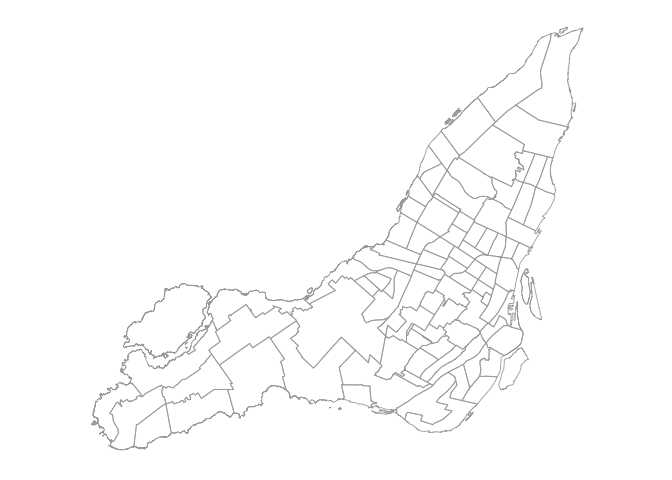
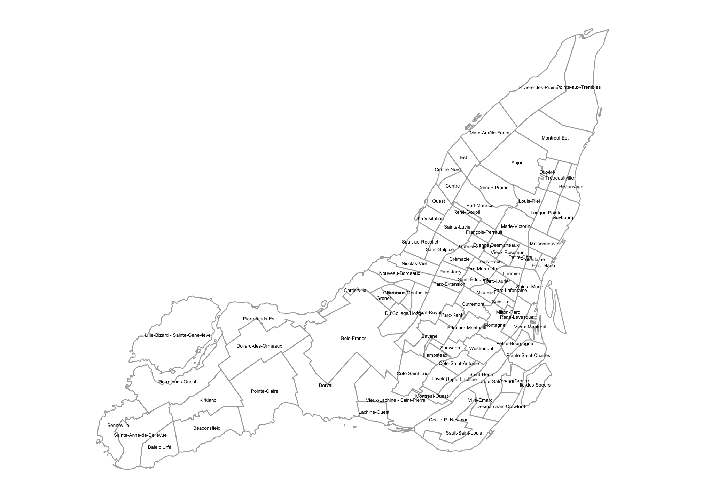
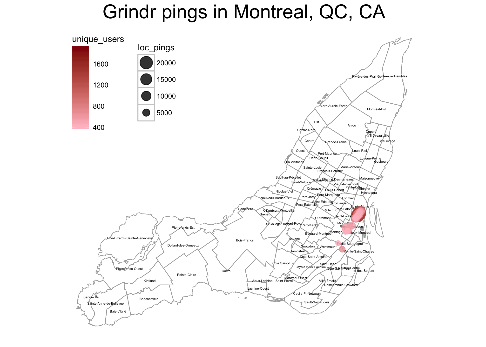

# Interactive (and Static) Mapping in R
Connor Gilroy  
`r Sys.Date()`  

## Outline

- Read Excel spreadsheet into R
- Convert geohash locations to latitude & longitude
- Filter data to look at one city
- Create interactive map using Leaflet
- (Bonus: Create static map using shapefiles and ggplot2)

## Dataset

The dataset I'm using is from a gay mobile dating app, Grindr. Grindr made available a small set of aggregated, anonymized user data for a [hackathon](https://hack4equality2016-onlineonly.devpost.com/) in September 2016.

The data don't have much of a public description, but they appear to contain data for the top 100 locations in each of 15 cities. 


```r
library(readxl)
data_file <- "data/Data4Equality-Aug27.xlsx"
sheet_names <- excel_sheets(data_file)
sheet_names
```

```
##  [1] "LA"           "Sacramento"   "Puerto Rico"  "San Diego"   
##  [5] "St Louis"     "Nashville"    "Evansville"   "Ottawa"      
##  [9] "Calgary"      "Johannesberg" "Cape Town"    "Montreal"    
## [13] "Arequipa"     "Lima"         "Durban"
```

----


```r
library(magrittr)
library(dplyr)
grindr_df <- 
  lapply(sheet_names, function(x) read_excel(data_file, sheet = x)) %>%
  set_names(sheet_names) %>%
  bind_rows(.id = "city")
head(grindr_df[, 1:6])
```

```
## # A tibble: 6 × 6
##    city geohash8 unique_users loc_pings age_less_than_21 age_21_30
##   <chr>    <chr>        <dbl>     <dbl>            <dbl>     <dbl>
## 1    LA 9q5cfj59         2934     16884               62      1530
## 2    LA 9q5cfj5f         1963      8088               43       880
## 3    LA 9q5cfhdq         1943      9235               30       984
## 4    LA 9q5cfj58         1794      5936               41       947
## 5    LA 9q5cfhfe         1792      7657               52       907
## 6    LA 9q5cfj52         1662      6304               43       900
```

## Geohash to lat/lng

Geohash is a way of encoding location data. The more digits, the more precise the location. In this case, we have geohashes of length 8, with an error of ±0.019km. We can use a library to decode the geohashes into latitudes, longitudes, and errors for each.


```r
library(geohash)
grindr_df_locs <-
  grindr_df %>%
  bind_cols(., gh_decode(.$geohash8))
```

----


```r
grindr_df_locs %>% 
  select(geohash8, lat, lng, lat_error, lng_error) %>% 
  head()
```

```
## # A tibble: 6 × 5
##   geohash8      lat       lng    lat_error    lng_error
##      <chr>    <dbl>     <dbl>        <dbl>        <dbl>
## 1 9q5cfj59 34.08534 -118.3837 8.583069e-05 0.0001716614
## 2 9q5cfj5f 34.08551 -118.3834 8.583069e-05 0.0001716614
## 3 9q5cfhdq 34.08345 -118.3854 8.583069e-05 0.0001716614
## 4 9q5cfj58 34.08517 -118.3837 8.583069e-05 0.0001716614
## 5 9q5cfhfe 34.08431 -118.3851 8.583069e-05 0.0001716614
## 6 9q5cfj52 34.08517 -118.3840 8.583069e-05 0.0001716614
```

## Montreal

Let's look at one city, Montreal. Montreal has the second-highest number of Grindr users of the 15 cities in the dataset, after Los Angeles.


```r
montreal_grindr_df <- 
  grindr_df_locs %>% 
  filter(city == "Montreal")
```

## Bounding box with `sp`

Create a "bounding box" for the Montreal locations.


```r
library(sp)
```

```
## Loading required package: methods
```

```r
mtl_bb <- 
  montreal_grindr_df %>% 
  select(lng, lat) %>% 
  SpatialPoints(CRS("+proj=longlat")) %>%
  bbox()
mtl_bb
```

```
##           min       max
## lng -73.58591 -73.55192
## lat  45.48280  45.52279
```

## Map with Leaflet

`leaflet` is an R interface to the JavaScript Leaflet library, which creates interactive maps. 

First, create a base map.


```r
library(leaflet)
m <- 
  leaflet(montreal_grindr_df) %>% 
  fitBounds(lng1 = mtl_bb[1, 1],
            lat1 = mtl_bb[2, 1],
            lng2 = mtl_bb[1, 2],
            lat2 = mtl_bb[2, 2]) %>%
  addTiles()
```

----

<!--html_preserve--><div id="htmlwidget-649cc820ae47c824bfb2" style="width:672px;height:480px;" class="leaflet html-widget"></div>
<script type="application/json" data-for="htmlwidget-649cc820ae47c824bfb2">{"x":{"fitBounds":[45.4827976226807,-73.5859107971191,45.5227947235107,-73.5519218444824],"calls":[{"method":"addTiles","args":["http://{s}.tile.openstreetmap.org/{z}/{x}/{y}.png",null,null,{"minZoom":0,"maxZoom":18,"maxNativeZoom":null,"tileSize":256,"subdomains":"abc","errorTileUrl":"","tms":false,"continuousWorld":false,"noWrap":false,"zoomOffset":0,"zoomReverse":false,"opacity":1,"zIndex":null,"unloadInvisibleTiles":null,"updateWhenIdle":null,"detectRetina":false,"reuseTiles":false,"attribution":"&copy; <a href=\"http://openstreetmap.org\">OpenStreetMap\u003c/a> contributors, <a href=\"http://creativecommons.org/licenses/by-sa/2.0/\">CC-BY-SA\u003c/a>"}]}]},"evals":[],"jsHooks":[]}</script><!--/html_preserve-->

## Plot data

Then, add markers, sized by the number of unique users, with popups.


```r
library(stringr)
m_markers <- 
  m %>% 
  addCircleMarkers(radius = ~unique_users/100,
                   popup = ~str_c(as.character(unique_users), 
                                  "unique users", sep = " "), 
                   weight = 1, opacity = .5, fillOpacity = .5)
```

```
## Assuming 'lng' and 'lat' are longitude and latitude, respectively
```

----

<!--html_preserve--><div id="htmlwidget-04ce8613f6d1bb9cccdf" style="width:672px;height:480px;" class="leaflet html-widget"></div>
<script type="application/json" data-for="htmlwidget-04ce8613f6d1bb9cccdf">{"x":{"fitBounds":[45.4827976226807,-73.5859107971191,45.5227947235107,-73.5519218444824],"calls":[{"method":"addTiles","args":["http://{s}.tile.openstreetmap.org/{z}/{x}/{y}.png",null,null,{"minZoom":0,"maxZoom":18,"maxNativeZoom":null,"tileSize":256,"subdomains":"abc","errorTileUrl":"","tms":false,"continuousWorld":false,"noWrap":false,"zoomOffset":0,"zoomReverse":false,"opacity":1,"zIndex":null,"unloadInvisibleTiles":null,"updateWhenIdle":null,"detectRetina":false,"reuseTiles":false,"attribution":"&copy; <a href=\"http://openstreetmap.org\">OpenStreetMap\u003c/a> contributors, <a href=\"http://creativecommons.org/licenses/by-sa/2.0/\">CC-BY-SA\u003c/a>"}]},{"method":"addCircleMarkers","args":[[45.5209064483643,45.5193614959717,45.5210781097412,45.51833152771,45.5210781097412,45.5195331573486,45.5197048187256,45.5207347869873,45.518159866333,45.5203914642334,45.5174732208252,45.5178165435791,45.5198764801025,45.5205631256104,45.5190181732178,45.5152416229248,45.5176448822021,45.5226230621338,45.5200481414795,45.5224514007568,45.5176448822021,45.5191898345947,45.5202198028564,45.5167865753174,45.5185031890869,45.5191898345947,45.5154132843018,45.5186748504639,45.5173015594482,45.5152416229248,45.5188465118408,45.5212497711182,45.5160999298096,45.5198764801025,45.5207347869873,45.5185031890869,45.5193614959717,45.5154132843018,45.5195331573486,45.5154132843018,45.5162715911865,45.5166149139404,45.5209064483643,45.5152416229248,45.5150699615479,45.5157566070557,45.5166149139404,45.5164432525635,45.51833152771,45.5179882049561,45.4827976226807,45.5159282684326,45.5150699615479,45.5159282684326,45.521936416626,45.5150699615479,45.5188465118408,45.5222797393799,45.5023670196533,45.5224514007568,45.5044269561768,45.5080318450928,45.5224514007568,45.5150699615479,45.5173015594482,45.5227947235107,45.5202198028564,45.5179882049561,45.5148983001709,45.5171298980713,45.5047702789307,45.5155849456787,45.5155849456787,45.5075168609619,45.5197048187256,45.5221080780029,45.5205631256104,45.5200481414795,45.5212497711182,45.5154132843018,45.5178165435791,45.5226230621338,45.5203914642334,45.5203914642334,45.5154132843018,45.521764755249,45.5174732208252,45.5006504058838,45.5152416229248,45.4891490936279,45.5011653900146,45.518159866333,45.5155849456787,45.5008220672607,45.5169582366943,45.5021953582764,45.5147266387939,45.5155849456787,45.5152416229248,45.5148983001709],[-73.5539817810059,-73.5553550720215,-73.553638458252,-73.5563850402832,-73.5539817810059,-73.5553550720215,-73.5550117492676,-73.5539817810059,-73.5563850402832,-73.5543251037598,-73.557071685791,-73.5567283630371,-73.5550117492676,-73.5543251037598,-73.5556983947754,-73.5611915588379,-73.5567283630371,-73.5522651672363,-73.5546684265137,-73.5522651672363,-73.557071685791,-73.5556983947754,-73.5546684265137,-73.5577583312988,-73.5560417175293,-73.5553550720215,-73.5598182678223,-73.5560417175293,-73.557071685791,-73.5598182678223,-73.5556983947754,-73.553638458252,-73.5584449768066,-73.5546684265137,-73.5543251037598,-73.5563850402832,-73.5556983947754,-73.5591316223145,-73.5550117492676,-73.5594749450684,-73.5584449768066,-73.5581016540527,-73.553638458252,-73.5594749450684,-73.5611915588379,-73.5587882995605,-73.5577583312988,-73.5581016540527,-73.5560417175293,-73.5567283630371,-73.5797309875488,-73.5587882995605,-73.560848236084,-73.5584449768066,-73.5529518127441,-73.5598182678223,-73.5560417175293,-73.5526084899902,-73.571834564209,-73.5519218444824,-73.5714912414551,-73.568058013916,-73.5526084899902,-73.5594749450684,-73.5574150085449,-73.5522651672363,-73.5543251037598,-73.5563850402832,-73.5598182678223,-73.5574150085449,-73.5721778869629,-73.5591316223145,-73.5598182678223,-73.564624786377,-73.5553550720215,-73.5529518127441,-73.5539817810059,-73.5550117492676,-73.5539817810059,-73.5601615905762,-73.5563850402832,-73.5526084899902,-73.5539817810059,-73.5546684265137,-73.5611915588379,-73.553295135498,-73.5567283630371,-73.5749244689941,-73.560848236084,-73.5859107971191,-73.5721778869629,-73.5560417175293,-73.5587882995605,-73.5745811462402,-73.5574150085449,-73.571834564209,-73.5598182678223,-73.5594749450684,-73.5615348815918,-73.5594749450684],[19.73,18.79,18.68,18.05,17.77,16.28,15.48,15.35,15.12,14.16,14.05,13.9,13.48,13.04,13.01,12.51,12.33,12.18,11.94,11.65,10.48,10.48,10.14,9.99,9.96,9.94,9.92,9.74,9.72,9.45,9.37,9.21,8.92,8.65,8.56,8.25,8.12,7.82,7.64,7.46,7.46,7.42,7.26,7.19,7.16,7.05,6.88,6.88,6.88,6.84,6.82,6.79,6.67,6.67,6.48,6.4,6.4,6.38,6.35,6.23,6.22,6.2,5.98,5.78,5.76,5.76,5.73,5.63,5.62,5.55,5.45,5.44,5.42,5.41,5.35,5.14,5.05,5.05,5.01,4.96,4.82,4.77,4.56,4.52,4.49,4.42,4.38,4.33,4.32,4.3,4.24,4.23,4.16,4.13,4.11,4.1,4.04,3.99,3.97,3.97],null,null,{"lineCap":null,"lineJoin":null,"clickable":true,"pointerEvents":null,"className":"","stroke":true,"color":"#03F","weight":1,"opacity":0.5,"fill":true,"fillColor":"#03F","fillOpacity":0.5,"dashArray":null},null,null,["1973 unique users","1879 unique users","1868 unique users","1805 unique users","1777 unique users","1628 unique users","1548 unique users","1535 unique users","1512 unique users","1416 unique users","1405 unique users","1390 unique users","1348 unique users","1304 unique users","1301 unique users","1251 unique users","1233 unique users","1218 unique users","1194 unique users","1165 unique users","1048 unique users","1048 unique users","1014 unique users","999 unique users","996 unique users","994 unique users","992 unique users","974 unique users","972 unique users","945 unique users","937 unique users","921 unique users","892 unique users","865 unique users","856 unique users","825 unique users","812 unique users","782 unique users","764 unique users","746 unique users","746 unique users","742 unique users","726 unique users","719 unique users","716 unique users","705 unique users","688 unique users","688 unique users","688 unique users","684 unique users","682 unique users","679 unique users","667 unique users","667 unique users","648 unique users","640 unique users","640 unique users","638 unique users","635 unique users","623 unique users","622 unique users","620 unique users","598 unique users","578 unique users","576 unique users","576 unique users","573 unique users","563 unique users","562 unique users","555 unique users","545 unique users","544 unique users","542 unique users","541 unique users","535 unique users","514 unique users","505 unique users","505 unique users","501 unique users","496 unique users","482 unique users","477 unique users","456 unique users","452 unique users","449 unique users","442 unique users","438 unique users","433 unique users","432 unique users","430 unique users","424 unique users","423 unique users","416 unique users","413 unique users","411 unique users","410 unique users","404 unique users","399 unique users","397 unique users","397 unique users"]]}],"limits":{"lat":[45.4827976226807,45.5227947235107],"lng":[-73.5859107971191,-73.5519218444824]}},"evals":[],"jsHooks":[]}</script><!--/html_preserve-->

## Los Angeles


```r
la_grindr_df <- grindr_df_locs %>% filter(city == "LA")
la_bb <- 
  la_grindr_df %>% 
  select(lng, lat) %>% 
  SpatialPoints(CRS("+proj=longlat")) %>% 
  bbox()
m_la <- 
  leaflet(la_grindr_df) %>% 
  fitBounds(la_bb[1, 1], la_bb[2, 1], la_bb[1, 2], la_bb[2, 2]) %>% 
  addTiles %>%
  addCircleMarkers(radius = ~unique_users/100, 
                   popup = ~str_c(as.character(unique_users), 
                                  "unique users", sep = " "),
                   weight = 1, opacity = .5, fillOpacity = .5)
```

```
## Assuming 'lng' and 'lat' are longitude and latitude, respectively
```

----

<!--html_preserve--><div id="htmlwidget-ad3f4226921f2abfa1f7" style="width:672px;height:480px;" class="leaflet html-widget"></div>
<script type="application/json" data-for="htmlwidget-ad3f4226921f2abfa1f7">{"x":{"fitBounds":[33.9406299591064,-118.404293060303,34.1023349761963,-118.240871429443],"calls":[{"method":"addTiles","args":["http://{s}.tile.openstreetmap.org/{z}/{x}/{y}.png",null,null,{"minZoom":0,"maxZoom":18,"maxNativeZoom":null,"tileSize":256,"subdomains":"abc","errorTileUrl":"","tms":false,"continuousWorld":false,"noWrap":false,"zoomOffset":0,"zoomReverse":false,"opacity":1,"zIndex":null,"unloadInvisibleTiles":null,"updateWhenIdle":null,"detectRetina":false,"reuseTiles":false,"attribution":"&copy; <a href=\"http://openstreetmap.org\">OpenStreetMap\u003c/a> contributors, <a href=\"http://creativecommons.org/licenses/by-sa/2.0/\">CC-BY-SA\u003c/a>"}]},{"method":"addCircleMarkers","args":[[34.0853404998779,34.0855121612549,34.0834522247314,34.085168838501,34.0843105316162,34.085168838501,34.0856838226318,34.0882587432861,34.0868854522705,34.0844821929932,34.0877437591553,34.0836238861084,34.0880870819092,34.0839672088623,34.0846538543701,34.0834522247314,34.0848255157471,34.0874004364014,34.0832805633545,34.084997177124,34.0875720977783,34.0882587432861,34.0841388702393,34.0880870819092,34.0879154205322,34.0858554840088,34.0884304046631,34.0856838226318,34.0837955474854,34.0855121612549,34.0867137908936,34.0870571136475,34.0844821929932,34.0839672088623,34.0860271453857,34.0841388702393,34.0891170501709,34.0836238861084,34.0853404998779,34.0906620025635,34.0834522247314,34.0904903411865,34.0874004364014,34.0908336639404,34.0879154205322,34.0837955474854,34.0906620025635,34.0977001190186,34.0832805633545,34.0846538543701,34.0858554840088,34.0908336639404,34.0892887115479,34.052209854126,34.0870571136475,34.0834522247314,34.0889453887939,34.0978717803955,34.0892887115479,34.0906620025635,34.0906620025635,34.1016483306885,34.0898036956787,34.0906620025635,34.08860206604,34.0391635894775,34.0884304046631,34.0853404998779,34.0906620025635,34.0872287750244,34.0896320343018,34.0875720977783,34.1016483306885,34.0832805633545,34.08860206604,34.0834522247314,34.0872287750244,34.0832805633545,34.0906620025635,34.088773727417,34.1006183624268,34.0906620025635,34.084997177124,33.9406299591064,34.0877437591553,34.0841388702393,34.0898036956787,34.0865421295166,34.0844821929932,34.0906620025635,34.0848255157471,34.0875720977783,34.0978717803955,34.0831089019775,34.0906620025635,34.0834522247314,34.0839672088623,34.0836238861084,34.0496349334717,34.1023349761963],[-118.383693695068,-118.383350372314,-118.385410308838,-118.383693695068,-118.385066986084,-118.384037017822,-118.383350372314,-118.378887176514,-118.381290435791,-118.38472366333,-118.379573822021,-118.385410308838,-118.378887176514,-118.385410308838,-118.384380340576,-118.385066986084,-118.384380340576,-118.380260467529,-118.385410308838,-118.384037017822,-118.379917144775,-118.37854385376,-118.385410308838,-118.379230499268,-118.379230499268,-118.383007049561,-118.37854385376,-118.383007049561,-118.385410308838,-118.383693695068,-118.381633758545,-118.381290435791,-118.385066986084,-118.385753631592,-118.382663726807,-118.385066986084,-118.37682723999,-118.385753631592,-118.383350372314,-118.344211578369,-118.297176361084,-118.344211578369,-118.379917144775,-118.361721038818,-118.379573822021,-118.385753631592,-118.367900848389,-118.365497589111,-118.385066986084,-118.38472366333,-118.383350372314,-118.362064361572,-118.376483917236,-118.243618011475,-118.380947113037,-118.297519683838,-118.377170562744,-118.365497589111,-118.37682723999,-118.344554901123,-118.370304107666,-118.339405059814,-118.376140594482,-118.376483917236,-118.378200531006,-118.240871429443,-118.378200531006,-118.384037017822,-118.371334075928,-118.380603790283,-118.376140594482,-118.379573822021,-118.342838287354,-118.297176361084,-118.377857208252,-118.385753631592,-118.380260467529,-118.297519683838,-118.368244171143,-118.377513885498,-118.332538604736,-118.369960784912,-118.384380340576,-118.404293060303,-118.379230499268,-118.385753631592,-118.375797271729,-118.381633758545,-118.384380340576,-118.373050689697,-118.384037017822,-118.379230499268,-118.365840911865,-118.385410308838,-118.37064743042,-118.297863006592,-118.385066986084,-118.386783599854,-118.249454498291,-118.339405059814],[29.34,19.63,19.43,17.94,17.92,16.62,15.11,14.04,13.92,13.08,13.04,12.89,12.68,12.14,12.13,11.9,11.82,11.38,11.01,10.55,10.55,10.47,10.4,10.37,10.29,9.9,9.81,9.77,9.33,9.15,8.9,8.8,8.57,8.55,8.5,8.44,8.43,8.41,8.13,8.08,7.94,7.91,7.61,7.46,7.23,7.21,7.12,7.08,7.06,7,6.9,6.87,6.85,6.77,6.4,6.36,6.3,6.28,6.22,6.22,6.17,6.16,6.07,5.99,5.91,5.91,5.9,5.85,5.85,5.85,5.79,5.78,5.75,5.73,5.72,5.7,5.67,5.65,5.59,5.57,5.57,5.5,5.48,5.47,5.41,5.4,5.38,5.38,5.38,5.35,5.35,5.33,5.32,5.27,5.25,5.23,5.21,5.21,5.2,5.19],null,null,{"lineCap":null,"lineJoin":null,"clickable":true,"pointerEvents":null,"className":"","stroke":true,"color":"#03F","weight":1,"opacity":0.5,"fill":true,"fillColor":"#03F","fillOpacity":0.5,"dashArray":null},null,null,["2934 unique users","1963 unique users","1943 unique users","1794 unique users","1792 unique users","1662 unique users","1511 unique users","1404 unique users","1392 unique users","1308 unique users","1304 unique users","1289 unique users","1268 unique users","1214 unique users","1213 unique users","1190 unique users","1182 unique users","1138 unique users","1101 unique users","1055 unique users","1055 unique users","1047 unique users","1040 unique users","1037 unique users","1029 unique users","990 unique users","981 unique users","977 unique users","933 unique users","915 unique users","890 unique users","880 unique users","857 unique users","855 unique users","850 unique users","844 unique users","843 unique users","841 unique users","813 unique users","808 unique users","794 unique users","791 unique users","761 unique users","746 unique users","723 unique users","721 unique users","712 unique users","708 unique users","706 unique users","700 unique users","690 unique users","687 unique users","685 unique users","677 unique users","640 unique users","636 unique users","630 unique users","628 unique users","622 unique users","622 unique users","617 unique users","616 unique users","607 unique users","599 unique users","591 unique users","591 unique users","590 unique users","585 unique users","585 unique users","585 unique users","579 unique users","578 unique users","575 unique users","573 unique users","572 unique users","570 unique users","567 unique users","565 unique users","559 unique users","557 unique users","557 unique users","550 unique users","548 unique users","547 unique users","541 unique users","540 unique users","538 unique users","538 unique users","538 unique users","535 unique users","535 unique users","533 unique users","532 unique users","527 unique users","525 unique users","523 unique users","521 unique users","521 unique users","520 unique users","519 unique users"]]}],"limits":{"lat":[33.9406299591064,34.1023349761963],"lng":[-118.404293060303,-118.240871429443]}},"evals":[],"jsHooks":[]}</script><!--/html_preserve-->

## All 15 cities


```r
pal <- colorFactor("Paired", sheet_names)
m_15 <- 
  leaflet(grindr_df_locs) %>% 
  addTiles() %>% 
  addCircleMarkers(popup = ~as.character(unique_users), 
                   color = ~pal(city), 
                   radius = 5, weight = 2,
                   opacity = .8, fillOpacity = 0.5) %>%
  addLegend(pal = pal, values = ~city)
```

```
## Assuming 'lng' and 'lat' are longitude and latitude, respectively
```

----

<!--html_preserve--><div id="htmlwidget-cb9553f74d8bdbf18058" style="width:672px;height:480px;" class="leaflet html-widget"></div>
<script type="application/json" data-for="htmlwidget-cb9553f74d8bdbf18058">{"x":{"calls":[{"method":"addTiles","args":["http://{s}.tile.openstreetmap.org/{z}/{x}/{y}.png",null,null,{"minZoom":0,"maxZoom":18,"maxNativeZoom":null,"tileSize":256,"subdomains":"abc","errorTileUrl":"","tms":false,"continuousWorld":false,"noWrap":false,"zoomOffset":0,"zoomReverse":false,"opacity":1,"zIndex":null,"unloadInvisibleTiles":null,"updateWhenIdle":null,"detectRetina":false,"reuseTiles":false,"attribution":"&copy; <a href=\"http://openstreetmap.org\">OpenStreetMap\u003c/a> contributors, <a href=\"http://creativecommons.org/licenses/by-sa/2.0/\">CC-BY-SA\u003c/a>"}]},{"method":"addCircleMarkers","args":[[34.0853404998779,34.0855121612549,34.0834522247314,34.085168838501,34.0843105316162,34.085168838501,34.0856838226318,34.0882587432861,34.0868854522705,34.0844821929932,34.0877437591553,34.0836238861084,34.0880870819092,34.0839672088623,34.0846538543701,34.0834522247314,34.0848255157471,34.0874004364014,34.0832805633545,34.084997177124,34.0875720977783,34.0882587432861,34.0841388702393,34.0880870819092,34.0879154205322,34.0858554840088,34.0884304046631,34.0856838226318,34.0837955474854,34.0855121612549,34.0867137908936,34.0870571136475,34.0844821929932,34.0839672088623,34.0860271453857,34.0841388702393,34.0891170501709,34.0836238861084,34.0853404998779,34.0906620025635,34.0834522247314,34.0904903411865,34.0874004364014,34.0908336639404,34.0879154205322,34.0837955474854,34.0906620025635,34.0977001190186,34.0832805633545,34.0846538543701,34.0858554840088,34.0908336639404,34.0892887115479,34.052209854126,34.0870571136475,34.0834522247314,34.0889453887939,34.0978717803955,34.0892887115479,34.0906620025635,34.0906620025635,34.1016483306885,34.0898036956787,34.0906620025635,34.08860206604,34.0391635894775,34.0884304046631,34.0853404998779,34.0906620025635,34.0872287750244,34.0896320343018,34.0875720977783,34.1016483306885,34.0832805633545,34.08860206604,34.0834522247314,34.0872287750244,34.0832805633545,34.0906620025635,34.088773727417,34.1006183624268,34.0906620025635,34.084997177124,33.9406299591064,34.0877437591553,34.0841388702393,34.0898036956787,34.0865421295166,34.0844821929932,34.0906620025635,34.0848255157471,34.0875720977783,34.0978717803955,34.0831089019775,34.0906620025635,34.0834522247314,34.0839672088623,34.0836238861084,34.0496349334717,34.1023349761963,38.5756587982178,38.5754871368408,38.5756587982178,38.5758304595947,38.5758304595947,38.5742855072021,38.5751438140869,38.5760021209717,38.5741138458252,38.5753154754639,38.5754871368408,38.57497215271,38.5751438140869,38.5808086395264,38.5756587982178,38.5761737823486,38.5806369781494,38.5739421844482,38.57497215271,38.5754871368408,38.5753154754639,38.695650100708,38.5758304595947,38.5792636871338,38.6015796661377,38.5744571685791,38.5760021209717,38.5742855072021,38.6122226715088,38.5763454437256,38.5806369781494,38.5741138458252,38.5792636871338,38.5808086395264,38.5809803009033,38.5794353485107,38.5753154754639,38.574800491333,38.5766887664795,38.5734272003174,38.5766887664795,38.5737705230713,38.5765171051025,38.5753154754639,38.6017513275146,38.6014080047607,38.5804653167725,38.574800491333,38.6019229888916,38.5751438140869,38.5765171051025,38.5789203643799,38.5991764068604,38.5761737823486,38.5739421844482,38.5809803009033,38.574800491333,38.574800491333,38.6122226715088,38.5679340362549,38.2750797271729,38.5772037506104,38.57497215271,38.5763454437256,38.5741138458252,38.7734127044678,38.5746288299561,38.5814952850342,38.691873550415,38.5705089569092,38.6925601959229,38.5959148406982,38.6927318572998,38.5760021209717,38.5761737823486,38.5775470733643,38.6930751800537,38.5741138458252,38.5751438140869,38.5741138458252,38.6007213592529,38.5735988616943,38.5770320892334,38.5754871368408,38.5753154754639,38.5751438140869,38.6020946502686,38.5706806182861,38.5746288299561,38.5804653167725,38.5746288299561,38.5773754119873,38.5715389251709,38.5765171051025,38.5773754119873,38.5801219940186,38.5768604278564,38.5742855072021,38.5706806182861,38.5735988616943,18.477029800415,18.4200382232666,18.4499073028564,18.4497356414795,18.4234714508057,18.4497356414795,18.4499073028564,18.4562587738037,18.4200382232666,18.4495639801025,18.4557437896729,18.4560871124268,18.4232997894287,18.4502506256104,18.4559154510498,18.4564304351807,18.4560871124268,18.4495639801025,18.4569454193115,18.44801902771,18.4559154510498,18.4569454193115,18.4500789642334,18.4030437469482,18.4208965301514,18.4567737579346,18.4566020965576,18.4572887420654,18.4557437896729,18.4502506256104,18.4207248687744,18.4564304351807,18.4562587738037,18.4232997894287,18.4559154510498,18.4567737579346,18.4500789642334,18.4191799163818,18.4207248687744,18.4555721282959,18.4507656097412,18.4202098846436,18.4574604034424,18.4512805938721,18.4566020965576,18.4564304351807,18.4605503082275,18.4511089324951,18.4569454193115,18.4493923187256,18.4210681915283,18.4505939483643,18.4555721282959,18.4236431121826,18.4572887420654,18.4456157684326,18.4519672393799,18.4454441070557,18.4674167633057,18.4538555145264,18.4511089324951,18.4505939483643,18.4517955780029,18.4459590911865,18.4032154083252,18.4540271759033,18.4555721282959,18.4428691864014,18.4509372711182,18.407678604126,18.455228805542,18.4569454193115,18.4030437469482,18.447847366333,18.455228805542,18.4536838531494,18.4504222869873,18.4511089324951,18.4566020965576,18.4456157684326,18.4677600860596,18.4567737579346,18.4566020965576,18.4679317474365,18.4454441070557,18.4485340118408,18.4457874298096,18.451623916626,18.455228805542,18.4461307525635,18.4571170806885,18.451623916626,18.4464740753174,18.4576320648193,18.4500789642334,18.407506942749,18.4557437896729,18.4579753875732,18.4226131439209,18.4545421600342,32.748441696167,32.748441696167,32.74827003479,32.74827003479,32.74827003479,32.748441696167,32.748441696167,32.74827003479,32.74827003479,32.748441696167,32.7486133575439,32.74827003479,32.74827003479,32.7486133575439,32.7486133575439,32.74827003479,32.74827003479,32.7479267120361,32.748441696167,32.748441696167,32.74827003479,32.74827003479,32.7480983734131,32.748441696167,32.7486133575439,32.7468967437744,32.7486133575439,32.74827003479,32.748441696167,32.7470684051514,32.748441696167,32.7486133575439,32.74827003479,32.7487850189209,32.7489566802979,32.748441696167,32.7491283416748,32.7493000030518,32.7487850189209,32.7491283416748,32.748441696167,32.7486133575439,32.748441696167,32.748441696167,32.7491283416748,32.7480983734131,32.74827003479,32.74827003479,32.7487850189209,32.7468967437744,32.7477550506592,32.7491283416748,32.7470684051514,32.7486133575439,32.7468967437744,32.748441696167,32.7480983734131,32.748441696167,32.7486133575439,32.7493000030518,32.748441696167,32.7486133575439,32.74827003479,32.7489566802979,32.7486133575439,32.7477550506592,32.748441696167,32.748441696167,32.7487850189209,32.7480983734131,32.7480983734131,32.7480983734131,32.7496433258057,32.7486133575439,32.7472400665283,32.748441696167,32.7493000030518,32.748441696167,32.7486133575439,32.7486133575439,32.7678394317627,32.7499866485596,32.7494716644287,32.7467250823975,32.748441696167,32.748441696167,32.7489566802979,32.7156543731689,32.7486133575439,32.74827003479,32.7499866485596,32.7487850189209,32.748441696167,32.7499866485596,32.748441696167,32.7493000030518,32.748441696167,32.7468967437744,32.7686977386475,32.7498149871826,38.6278438568115,38.6276721954346,38.6275005340576,38.6276721954346,38.6276721954346,38.6362552642822,38.6276721954346,38.6364269256592,38.6275005340576,38.6362552642822,38.6273288726807,38.6317920684814,38.6278438568115,38.6323070526123,38.6364269256592,38.6319637298584,38.6446666717529,38.6273288726807,38.6321353912354,38.6275005340576,38.6290454864502,38.7371921539307,38.6276721954346,38.7370204925537,38.6275005340576,38.6278438568115,38.6278438568115,38.6360836029053,38.6280155181885,38.6278438568115,38.6273288726807,38.6319637298584,38.6262989044189,38.6448383331299,38.7373638153076,38.4984111785889,38.6275005340576,38.6276721954346,38.6336803436279,38.6072444915771,38.6273288726807,38.6450099945068,38.6292171478271,38.6238956451416,38.6321353912354,38.7423419952393,38.6317920684814,38.6365985870361,38.6257839202881,38.6448383331299,38.6441516876221,38.6364269256592,38.626127243042,38.6364269256592,38.6276721954346,38.625955581665,38.6027812957764,38.6321353912354,38.7366771697998,38.6288738250732,38.6328220367432,38.7421703338623,38.6026096343994,38.6305904388428,38.6280155181885,38.6273288726807,38.6214923858643,38.625955581665,38.6275005340576,38.6129093170166,38.6271572113037,38.6348819732666,38.6307621002197,38.6240673065186,38.6271572113037,38.6302471160889,38.7378787994385,38.625955581665,38.6439800262451,38.6275005340576,38.6304187774658,38.6307621002197,38.6336803436279,38.6453533172607,38.6451816558838,38.6264705657959,38.6072444915771,38.626127243042,38.6336803436279,38.6275005340576,38.6269855499268,38.6281871795654,38.6365985870361,38.6221790313721,38.6300754547119,38.6281871795654,38.6257839202881,38.625955581665,38.5998630523682,38.6278438568115,36.1567783355713,36.1569499969482,36.1555767059326,36.1567783355713,36.1566066741943,36.1557483673096,36.1567783355713,36.1289691925049,36.1569499969482,36.1566066741943,36.161413192749,36.1557483673096,36.1569499969482,36.1612415313721,36.1571216583252,36.1608982086182,36.1564350128174,36.1607265472412,36.1610698699951,36.161584854126,36.1554050445557,36.1626148223877,36.1571216583252,36.1607265472412,36.1372089385986,36.2026119232178,36.1390972137451,36.161413192749,36.1282825469971,36.1324024200439,36.1605548858643,36.1315441131592,36.1607265472412,36.1608982086182,36.1069965362549,36.1287975311279,36.1559200286865,36.1279392242432,36.1619281768799,36.1603832244873,36.1306858062744,36.15403175354,36.1773777008057,36.1772060394287,36.1564350128174,36.1317157745361,36.1617565155029,36.157808303833,36.1299991607666,36.1608982086182,36.1392688751221,36.161413192749,36.161584854126,36.1605548858643,36.1569499969482,36.1572933197021,36.1073398590088,36.1303424835205,36.1619281768799,36.161413192749,36.1634731292725,36.1282825469971,36.2125682830811,36.0374736785889,36.1612415313721,36.1602115631104,36.1535167694092,36.1428737640381,36.1608982086182,36.1071681976318,36.157808303833,36.1607265472412,36.1610698699951,36.1560916900635,36.1471652984619,36.1608982086182,36.2043285369873,36.1770343780518,36.1562633514404,36.1608982086182,36.1562633514404,36.1574649810791,36.1552333831787,36.1612415313721,36.1569499969482,36.1612415313721,36.150426864624,36.1526584625244,36.13205909729,36.1620998382568,36.1370372772217,36.1370372772217,36.1773777008057,36.1610698699951,36.1296558380127,36.1536884307861,36.1566066741943,36.1301708221436,36.1555767059326,36.1617565155029,37.9755306243896,37.9827404022217,37.9825687408447,37.9757022857666,37.9753589630127,37.9755306243896,37.9758739471436,37.9757022857666,37.9719257354736,37.9724407196045,37.9822254180908,37.9722690582275,37.9724407196045,38.0078029632568,37.9822254180908,37.9720973968506,37.9825687408447,37.9727840423584,37.9758739471436,37.9846286773682,37.977933883667,37.9823970794678,37.9720973968506,38.1746578216553,37.9781055450439,37.9801654815674,37.9654026031494,37.9823970794678,38.0076313018799,37.9767322540283,37.9772472381592,37.9801654815674,37.9765605926514,37.8639507293701,37.9729557037354,37.9724407196045,37.9530429840088,37.9827404022217,37.9848003387451,37.9774188995361,37.977933883667,38.3468341827393,37.9755306243896,37.9846286773682,37.9628276824951,38.1746578216553,37.9918384552002,37.970552444458,37.875452041626,37.9642009735107,37.9774188995361,37.97776222229,37.9729557037354,37.9829120635986,38.0033397674561,38.0011081695557,37.9784488677979,37.9818820953369,37.8665256500244,37.9846286773682,37.9703807830811,37.9767322540283,37.9750156402588,38.1736278533936,37.98171043396,37.9530429840088,37.9837703704834,38.0078029632568,37.9532146453857,37.9750156402588,37.9818820953369,37.9671192169189,37.9765605926514,37.9848003387451,38.3466625213623,37.9798221588135,37.9762172698975,38.0079746246338,37.9848003387451,38.3466625213623,37.9643726348877,37.8563976287842,37.9757022857666,37.9820537567139,37.9825687408447,37.9916667938232,37.9571628570557,38.0460834503174,37.9772472381592,37.9849720001221,37.9829120635986,37.9775905609131,37.9554462432861,37.9842853546143,37.9928684234619,37.9671192169189,37.9767322540283,37.9920101165771,37.9755306243896,37.9844570159912,45.3157711029053,45.3155994415283,45.2925968170166,45.3332805633545,45.3157711029053,45.3155994415283,45.2934551239014,45.3025531768799,45.3154277801514,45.2606678009033,45.2979183197021,45.3334522247314,45.2950000762939,45.2980899810791,44.8982906341553,45.3008365631104,45.2977466583252,45.3154277801514,45.4242610931396,45.2951717376709,45.3106212615967,45.2979183197021,45.2934551239014,45.3006649017334,45.2960300445557,45.3113079071045,45.1319217681885,45.2979183197021,45.2927684783936,45.3099346160889,45.2972316741943,45.1418781280518,45.3224658966064,45.3380870819092,45.29860496521,45.3099346160889,45.3025531768799,45.2950000762939,45.1398181915283,45.302038192749,45.2970600128174,45.3113079071045,45.3155994415283,45.4759311676025,45.3099346160889,45.2683925628662,45.2974033355713,45.3478717803955,45.2989482879639,45.3042697906494,45.3332805633545,45.1324367523193,45.1322650909424,45.3480434417725,45.2745723724365,45.1295185089111,45.2951717376709,45.2963733673096,45.2998065948486,45.3101062774658,45.3039264678955,45.2962017059326,45.3114795684814,45.2877902984619,45.2869319915771,45.3547382354736,45.3382587432861,45.29860496521,45.3099346160889,45.3588581085205,45.3097629547119,45.2872753143311,45.2790355682373,45.4790210723877,45.2967166900635,45.3118228912354,45.298433303833,45.3097629547119,45.3145694732666,45.1320934295654,45.2867603302002,45.3114795684814,45.2972316741943,45.2968883514404,45.3025531768799,45.3111362457275,45.2979183197021,45.2871036529541,45.1466846466064,45.3114795684814,45.2747440338135,45.3099346160889,45.2967166900635,45.3370571136475,45.3588581085205,45.2834987640381,45.3089046478271,45.3111362457275,45.3159427642822,43.6667919158936,50.9979343414307,51.0430812835693,50.9981060028076,51.0461711883545,51.0430812835693,51.1328601837158,51.0463428497314,51.0463428497314,51.048059463501,51.0381031036377,51.0461711883545,51.1320018768311,51.1326885223389,51.0430812835693,51.0434246063232,51.0461711883545,51.0379314422607,51.1287403106689,50.9981060028076,51.0466861724854,51.0379314422607,51.0468578338623,51.1302852630615,51.1294269561768,51.0429096221924,51.0463428497314,51.0468578338623,51.0432529449463,51.1289119720459,51.0382747650146,51.0379314422607,51.0470294952393,51.1326885223389,50.9958744049072,51.0466861724854,51.0485744476318,51.132345199585,51.0456562042236,50.9991359710693,51.0429096221924,50.9998226165771,51.0456562042236,51.132173538208,51.0411930084229,51.0382747650146,51.0468578338623,51.0463428497314,51.0468578338623,51.0001659393311,51.1309719085693,51.0463428497314,50.996561050415,51.0468578338623,51.0377597808838,51.0520076751709,51.0413646697998,51.1287403106689,50.9960460662842,51.0466861724854,50.9955310821533,51.0465145111084,51.0379314422607,51.0458278656006,51.1326885223389,50.9957027435303,51.0379314422607,51.1311435699463,51.0446262359619,51.0379314422607,51.0497760772705,51.1302852630615,51.0461711883545,51.0461711883545,51.0496044158936,51.0429096221924,51.0447978973389,51.0432529449463,51.0456562042236,51.0458278656006,51.0379314422607,51.0463428497314,51.0446262359619,51.0834217071533,50.9958744049072,51.0377597808838,51.0743236541748,51.128568649292,51.0435962677002,51.0465145111084,51.1325168609619,51.0496044158936,51.0382747650146,51.1313152313232,51.0477161407471,50.9998226165771,51.0465145111084,51.0470294952393,51.0470294952393,51.0456562042236,50.9972476959229,-26.134672164917,-26.1077213287354,-26.1073780059814,-26.0771656036377,-26.1075496673584,-26.1084079742432,-26.1092662811279,-26.1082363128662,-26.1460018157959,-26.1437702178955,-26.108922958374,-26.1073780059814,-26.1082363128662,-26.0773372650146,-26.1102962493896,-26.1351871490479,-26.024808883667,-26.1448001861572,-26.1362171173096,-26.1075496673584,-25.8763217926025,-26.1449718475342,-26.0153675079346,-26.1305522918701,-26.1461734771729,-26.1765575408936,-26.0769939422607,-26.1075496673584,-26.2040233612061,-26.1365604400635,-25.8764934539795,-26.1575031280518,-26.1305522918701,-26.1435985565186,-26.017599105835,-26.1942386627197,-26.1101245880127,-26.0151958465576,-26.131067276001,-26.1351871490479,-26.1573314666748,-26.0773372650146,-26.1362171173096,-26.1324405670166,-26.1353588104248,-26.1080646514893,-26.0771656036377,-26.1334705352783,-26.1336421966553,-26.1314105987549,-26.1763858795166,-26.0986232757568,-26.024808883667,-26.1204242706299,-26.0938167572021,-26.1315822601318,-26.1439418792725,-26.1068630218506,-26.1207675933838,-26.1082363128662,-26.1331272125244,-26.0775089263916,-26.1063480377197,-26.1365604400635,-26.1449718475342,-26.1080646514893,-26.1944103240967,-26.0769939422607,-26.1072063446045,-26.134672164917,-26.1762142181396,-26.1774158477783,-26.1437702178955,-26.1077213287354,-26.0249805450439,-26.1350154876709,-26.0237789154053,-26.0948467254639,-26.1448001861572,-26.1061763763428,-26.1080646514893,-26.1439418792725,-26.1451435089111,-26.1327838897705,-26.0989665985107,-26.0150241851807,-26.0533046722412,-26.1075496673584,-26.1363887786865,-26.1363887786865,-26.0148525238037,-26.1078929901123,-26.0771656036377,-26.1441135406494,-26.1317539215088,-26.1360454559326,-26.1154460906982,-26.1437702178955,-26.0239505767822,-26.1331272125244,-33.9148807525635,-33.9164257049561,-33.9162540435791,-33.9150524139404,-33.9153957366943,-33.9150524139404,-33.9152240753174,-33.9040660858154,-33.9143657684326,-33.9145374298096,-33.9148807525635,-33.9248371124268,-33.9133358001709,-33.916597366333,-33.9155673980713,-33.9160823822021,-33.9224338531494,-33.9033794403076,-33.9038944244385,-33.9140224456787,-33.9177989959717,-33.9038944244385,-33.9155673980713,-33.9177989959717,-33.9042377471924,-33.9164257049561,-33.9186573028564,-33.9150524139404,-33.9224338531494,-33.9062976837158,-33.9160823822021,-33.9272403717041,-33.9152240753174,-33.9155673980713,-33.923807144165,-33.9329051971436,-33.9162540435791,-33.9032077789307,-33.9083576202393,-33.9153957366943,-33.9153957366943,-33.9330768585205,-33.9159107208252,-33.9150524139404,-33.9155673980713,-33.9195156097412,-33.9147090911865,-33.9147090911865,-33.9147090911865,-33.9153957366943,-33.9138507843018,-33.9262104034424,-33.9152240753174,-33.9329051971436,-33.9152240753174,-33.9150524139404,-33.9080142974854,-33.9133358001709,-33.9329051971436,-33.9210605621338,-33.9159107208252,-33.9148807525635,-33.9157390594482,-33.9081859588623,-33.9145374298096,-33.9157390594482,-33.91676902771,-33.9255237579346,-33.9062976837158,-33.9035511016846,-33.9148807525635,-33.9298152923584,-33.9090442657471,-33.9188289642334,-33.9323902130127,-33.9595127105713,-33.9143657684326,-33.9157390594482,-33.9148807525635,-33.9217472076416,-33.9052677154541,-33.9040660858154,-33.9220905303955,-33.916597366333,-33.9064693450928,-33.9593410491943,-33.9226055145264,-33.9148807525635,-33.9219188690186,-33.9222621917725,-33.9274120330811,-33.9179706573486,-33.9293003082275,-33.9208889007568,-33.923978805542,-33.9260387420654,-33.9224338531494,-33.9164257049561,-33.9200305938721,-33.9224338531494,45.5209064483643,45.5193614959717,45.5210781097412,45.51833152771,45.5210781097412,45.5195331573486,45.5197048187256,45.5207347869873,45.518159866333,45.5203914642334,45.5174732208252,45.5178165435791,45.5198764801025,45.5205631256104,45.5190181732178,45.5152416229248,45.5176448822021,45.5226230621338,45.5200481414795,45.5224514007568,45.5176448822021,45.5191898345947,45.5202198028564,45.5167865753174,45.5185031890869,45.5191898345947,45.5154132843018,45.5186748504639,45.5173015594482,45.5152416229248,45.5188465118408,45.5212497711182,45.5160999298096,45.5198764801025,45.5207347869873,45.5185031890869,45.5193614959717,45.5154132843018,45.5195331573486,45.5154132843018,45.5162715911865,45.5166149139404,45.5209064483643,45.5152416229248,45.5150699615479,45.5157566070557,45.5166149139404,45.5164432525635,45.51833152771,45.5179882049561,45.4827976226807,45.5159282684326,45.5150699615479,45.5159282684326,45.521936416626,45.5150699615479,45.5188465118408,45.5222797393799,45.5023670196533,45.5224514007568,45.5044269561768,45.5080318450928,45.5224514007568,45.5150699615479,45.5173015594482,45.5227947235107,45.5202198028564,45.5179882049561,45.5148983001709,45.5171298980713,45.5047702789307,45.5155849456787,45.5155849456787,45.5075168609619,45.5197048187256,45.5221080780029,45.5205631256104,45.5200481414795,45.5212497711182,45.5154132843018,45.5178165435791,45.5226230621338,45.5203914642334,45.5203914642334,45.5154132843018,45.521764755249,45.5174732208252,45.5006504058838,45.5152416229248,45.4891490936279,45.5011653900146,45.518159866333,45.5155849456787,45.5008220672607,45.5169582366943,45.5021953582764,45.5147266387939,45.5155849456787,45.5152416229248,45.5148983001709,-16.3988971710205,-16.3964939117432,-16.3988971710205,-16.3899707794189,-16.3987255096436,-16.3990688323975,-16.3988971710205,-16.3985538482666,-16.3963222503662,-16.3990688323975,-16.3964939117432,-16.3987255096436,-16.3987255096436,-16.3911724090576,-16.3966655731201,-16.3892841339111,-16.3987255096436,-16.3952922821045,-16.3954639434814,-16.3976955413818,-16.3951206207275,-16.3444805145264,-16.3987255096436,-16.3963222503662,-16.3985538482666,-16.3901424407959,-16.3966655731201,-16.3985538482666,-16.4311695098877,-16.3966655731201,-16.3973522186279,-16.3983821868896,-16.3903141021729,-16.3891124725342,-16.3985538482666,-16.4179515838623,-16.3952922821045,-16.3988971710205,-16.4074802398682,-16.3954639434814,-16.3973522186279,-16.3894557952881,-16.3985538482666,-16.389627456665,-16.4179515838623,-16.3992404937744,-16.3968372344971,-16.389799118042,-16.3988971710205,-16.3961505889893,-16.3961505889893,-16.3990688323975,-16.3975238800049,-16.3947772979736,-16.3904857635498,-16.3449954986572,-16.4162349700928,-16.4107418060303,-16.3899707794189,-16.3988971710205,-16.3906574249268,-16.3968372344971,-16.3987255096436,-16.3947772979736,-16.3899707794189,-16.389799118042,-16.3985538482666,-16.3964939117432,-16.3951206207275,-16.3956356048584,-16.3983821868896,-16.3990688323975,-16.3973522186279,-16.3903141021729,-16.3966655731201,-16.3983821868896,-16.3987255096436,-16.3961505889893,-16.3980388641357,-16.3964939117432,-16.4000988006592,-16.397180557251,-16.3978672027588,-16.3892841339111,-16.4174365997314,-16.3892841339111,-16.3968372344971,-16.4169216156006,-16.3973522186279,-16.4160633087158,-16.3999271392822,-16.3995838165283,-16.3910007476807,-16.397180557251,-16.3995838165283,-16.3982105255127,-16.4042186737061,-16.4181232452393,-16.3997554779053,-16.3975238800049,-12.119722366333,-12.1195507049561,-12.1236705780029,-12.1228122711182,-12.1205806732178,-12.1245288848877,-12.0568943023682,-12.1221256256104,-12.0568943023682,-12.1229839324951,-12.0563793182373,-12.1207523345947,-12.1224689483643,-12.1236705780029,-12.0567226409912,-12.1226406097412,-12.1228122711182,-12.1243572235107,-12.1247005462646,-12.1224689483643,-12.1222972869873,-12.1186923980713,-12.1322536468506,-12.1190357208252,-12.090368270874,-12.11989402771,-12.1226406097412,-12.1228122711182,-12.1226406097412,-12.1192073822021,-12.0565509796143,-12.0563793182373,-12.1229839324951,-12.1238422393799,-12.1205806732178,-12.123327255249,-12.1204090118408,-12.1231555938721,-12.1288204193115,-12.1228122711182,-12.0769786834717,-12.0570659637451,-12.1217823028564,-12.1228122711182,-12.1190357208252,-12.1188640594482,-12.1190357208252,-12.123498916626,-12.0901966094971,-12.1238422393799,-12.1219539642334,-12.1188640594482,-12.0562076568604,-12.1116542816162,-12.0864200592041,-12.1190357208252,-12.1231555938721,-12.1137142181396,-12.1190357208252,-12.1192073822021,-12.1247005462646,-12.1212673187256,-12.1192073822021,-12.1245288848877,-12.1209239959717,-12.1190357208252,-12.090539932251,-12.1193790435791,-12.1190357208252,-12.119722366333,-12.1247005462646,-12.0762920379639,-12.0563793182373,-12.1245288848877,-12.1190357208252,-12.1226406097412,-12.1192073822021,-12.1248722076416,-12.0567226409912,-12.11989402771,-12.1186923980713,-12.1190357208252,-12.1229839324951,-12.1241855621338,-12.1192073822021,-12.1204090118408,-12.123498916626,-12.1209239959717,-12.1494197845459,-12.0541477203369,-12.1207523345947,-12.1222972869873,-12.0548343658447,-12.1245288848877,-12.0900249481201,-12.123327255249,-12.1195507049561,-12.05397605896,-12.1214389801025,-12.1118259429932,-29.6195697784424,-29.8346614837646,-29.7263431549072,-29.8487377166748,-29.7258281707764,-29.7259998321533,-29.7256565093994,-29.7246265411377,-29.723596572876,-29.7259998321533,-29.7265148162842,-29.8358631134033,-29.7220516204834,-29.7259998321533,-29.7237682342529,-29.7249698638916,-29.7244548797607,-29.8291683197021,-29.7261714935303,-29.6183681488037,-29.7273731231689,-29.7259998321533,-29.6190547943115,-29.727201461792,-29.8487377166748,-29.727201461792,-29.6188831329346,-29.7251415252686,-29.727029800415,-29.7282314300537,-29.8495960235596,-29.7275447845459,-29.7266864776611,-29.8483943939209,-29.6188831329346,-29.7268581390381,-29.6193981170654,-29.8497676849365,-29.7507190704346,-29.7273731231689,-29.8358631134033,-29.8485660552979,-29.8372364044189,-29.8586940765381,-29.8489093780518,-29.7247982025146,-29.727029800415,-29.8398113250732,-29.8326015472412,-29.7258281707764,-29.7237682342529,-29.7246265411377,-29.7239398956299,-29.8465061187744,-29.7241115570068,-29.8346614837646,-29.8319149017334,-29.8703670501709,-29.8358631134033,-29.8399829864502,-29.7266864776611,-29.7237682342529,-29.727029800415,-29.7242832183838,-29.8418712615967,-29.8348331451416,-29.7277164459229,-29.8490810394287,-29.7259998321533,-29.7505474090576,-29.7237682342529,-29.6195697784424,-29.8466777801514,-29.7239398956299,-29.7266864776611,-29.723596572876,-29.8399829864502,-29.7258281707764,-29.8265933990479,-29.8392963409424,-29.8356914520264,-29.8329448699951,-29.7258281707764,-29.7263431549072,-29.6187114715576,-29.7508907318115,-29.7261714935303,-29.7268581390381,-29.7546672821045,-29.7539806365967,-29.7259998321533,-29.8501110076904,-29.7265148162842,-29.8495960235596,-29.7253131866455,-29.8401546478271,-29.7230815887451,-29.727029800415,-29.7263431549072,-29.8576641082764],[-118.383693695068,-118.383350372314,-118.385410308838,-118.383693695068,-118.385066986084,-118.384037017822,-118.383350372314,-118.378887176514,-118.381290435791,-118.38472366333,-118.379573822021,-118.385410308838,-118.378887176514,-118.385410308838,-118.384380340576,-118.385066986084,-118.384380340576,-118.380260467529,-118.385410308838,-118.384037017822,-118.379917144775,-118.37854385376,-118.385410308838,-118.379230499268,-118.379230499268,-118.383007049561,-118.37854385376,-118.383007049561,-118.385410308838,-118.383693695068,-118.381633758545,-118.381290435791,-118.385066986084,-118.385753631592,-118.382663726807,-118.385066986084,-118.37682723999,-118.385753631592,-118.383350372314,-118.344211578369,-118.297176361084,-118.344211578369,-118.379917144775,-118.361721038818,-118.379573822021,-118.385753631592,-118.367900848389,-118.365497589111,-118.385066986084,-118.38472366333,-118.383350372314,-118.362064361572,-118.376483917236,-118.243618011475,-118.380947113037,-118.297519683838,-118.377170562744,-118.365497589111,-118.37682723999,-118.344554901123,-118.370304107666,-118.339405059814,-118.376140594482,-118.376483917236,-118.378200531006,-118.240871429443,-118.378200531006,-118.384037017822,-118.371334075928,-118.380603790283,-118.376140594482,-118.379573822021,-118.342838287354,-118.297176361084,-118.377857208252,-118.385753631592,-118.380260467529,-118.297519683838,-118.368244171143,-118.377513885498,-118.332538604736,-118.369960784912,-118.384380340576,-118.404293060303,-118.379230499268,-118.385753631592,-118.375797271729,-118.381633758545,-118.384380340576,-118.373050689697,-118.384037017822,-118.379230499268,-118.365840911865,-118.385410308838,-118.37064743042,-118.297863006592,-118.385066986084,-118.386783599854,-118.249454498291,-118.339405059814,-121.480464935303,-121.480464935303,-121.480121612549,-121.480464935303,-121.480121612549,-121.481151580811,-121.480464935303,-121.480121612549,-121.481151580811,-121.480464935303,-121.480121612549,-121.480464935303,-121.480808258057,-121.498317718506,-121.479778289795,-121.480121612549,-121.498317718506,-121.481151580811,-121.480808258057,-121.479778289795,-121.480808258057,-121.593761444092,-121.479778289795,-121.489734649658,-121.427593231201,-121.481151580811,-121.480464935303,-121.481494903564,-121.445789337158,-121.480121612549,-121.497974395752,-121.481494903564,-121.490077972412,-121.497974395752,-121.498317718506,-121.490077972412,-121.480121612549,-121.480808258057,-121.480121612549,-121.481151580811,-121.479778289795,-121.481151580811,-121.480121612549,-121.479778289795,-121.428623199463,-121.427249908447,-121.497974395752,-121.477718353271,-121.428623199463,-121.480121612549,-121.479778289795,-121.493167877197,-121.423816680908,-121.486301422119,-121.481494903564,-121.497974395752,-121.481151580811,-121.480464935303,-121.446132659912,-121.485958099365,-121.300220489502,-121.481151580811,-121.480121612549,-121.478748321533,-121.479434967041,-121.270351409912,-121.480808258057,-121.494541168213,-121.591701507568,-121.481494903564,-121.588611602783,-121.416263580322,-121.588611602783,-121.479778289795,-121.480464935303,-121.491451263428,-121.587581634521,-121.480808258057,-121.483554840088,-121.475315093994,-121.426906585693,-121.481494903564,-121.481151580811,-121.480808258057,-121.479091644287,-121.479091644287,-121.428623199463,-121.481494903564,-121.477718353271,-121.493854522705,-121.481151580811,-121.491107940674,-121.488018035889,-121.487331390381,-121.485614776611,-121.484241485596,-121.480121612549,-121.480808258057,-121.481151580811,-121.481151580811,-66.8324089050293,-66.0626792907715,-66.0760688781738,-66.0760688781738,-66.0746955871582,-66.0757255554199,-66.0757255554199,-66.0722923278809,-66.0623359680176,-66.0760688781738,-66.0705757141113,-66.071605682373,-66.0746955871582,-66.0757255554199,-66.071605682373,-66.0726356506348,-66.071949005127,-66.0757255554199,-66.0740089416504,-66.0760688781738,-66.0712623596191,-66.0743522644043,-66.0757255554199,-66.0547828674316,-66.0736656188965,-66.0736656188965,-66.0733222961426,-66.0722923278809,-66.071949005127,-66.0698890686035,-66.0740089416504,-66.0712623596191,-66.071949005127,-66.0750389099121,-66.071949005127,-66.0740089416504,-66.0760688781738,-66.0712623596191,-66.0743522644043,-66.071949005127,-66.0743522644043,-66.0623359680176,-66.0722923278809,-66.0750389099121,-66.0712623596191,-66.0729789733887,-66.0808753967285,-66.0743522644043,-66.0726356506348,-66.0760688781738,-66.0733222961426,-66.0743522644043,-66.0702323913574,-66.0746955871582,-66.071949005127,-66.0667991638184,-66.0640525817871,-66.0671424865723,-66.1172676086426,-66.0736656188965,-66.0740089416504,-66.0705757141113,-66.0616493225098,-66.068172454834,-66.0547828674316,-66.0736656188965,-66.0705757141113,-66.0657691955566,-66.0743522644043,-66.1622428894043,-66.0722923278809,-66.0746955871582,-66.0544395446777,-66.0760688781738,-66.0692024230957,-66.0736656188965,-66.0757255554199,-66.0750389099121,-66.0726356506348,-66.0671424865723,-66.1189842224121,-66.0726356506348,-66.0729789733887,-66.1189842224121,-66.0674858093262,-66.0757255554199,-66.0667991638184,-66.064395904541,-66.0688591003418,-66.0685157775879,-66.0726356506348,-66.0647392272949,-66.068172454834,-66.0750389099121,-66.0657691955566,-66.0657691955566,-66.0709190368652,-66.075382232666,-66.0740089416504,-66.0578727722168,-117.16215133667,-117.154941558838,-117.162494659424,-117.154941558838,-117.16215133667,-117.162494659424,-117.159748077393,-117.160778045654,-117.162837982178,-117.153911590576,-117.152538299561,-117.161808013916,-117.153911590576,-117.153911590576,-117.152881622314,-117.154598236084,-117.161464691162,-117.1604347229,-117.159404754639,-117.154598236084,-117.161121368408,-117.1604347229,-117.1604347229,-117.161808013916,-117.151165008545,-117.1604347229,-117.153568267822,-117.15425491333,-117.155284881592,-117.1604347229,-117.150821685791,-117.142581939697,-117.151165008545,-117.152538299561,-117.1604347229,-117.153568267822,-117.161464691162,-117.161464691162,-117.152881622314,-117.1604347229,-117.162837982178,-117.153224945068,-117.157344818115,-117.15425491333,-117.161808013916,-117.153911590576,-117.160091400146,-117.155284881592,-117.152194976807,-117.160091400146,-117.1604347229,-117.160091400146,-117.160091400146,-117.150821685791,-117.159748077393,-117.151165008545,-117.15425491333,-117.155628204346,-117.152194976807,-117.1604347229,-117.151508331299,-117.142925262451,-117.159748077393,-117.161808013916,-117.161808013916,-117.160091400146,-117.160091400146,-117.161464691162,-117.1604347229,-117.161808013916,-117.154941558838,-117.161464691162,-117.1604347229,-117.151508331299,-117.1604347229,-117.159061431885,-117.161808013916,-117.150478363037,-117.157344818115,-117.154941558838,-117.150478363037,-117.161464691162,-117.153911590576,-117.1604347229,-117.142581939697,-117.157688140869,-117.160091400146,-117.161121368408,-117.159404754639,-117.153568267822,-117.161808013916,-117.153224945068,-117.152538299561,-117.16215133667,-117.152881622314,-117.160091400146,-117.146701812744,-117.160778045654,-117.147731781006,-117.161808013916,-90.2501106262207,-90.2507972717285,-90.2507972717285,-90.2511405944824,-90.2501106262207,-90.2137184143066,-90.2497673034668,-90.2140617370605,-90.2511405944824,-90.2140617370605,-90.2507972717285,-90.2425575256348,-90.2497673034668,-90.2429008483887,-90.2137184143066,-90.2429008483887,-90.2614402770996,-90.2511405944824,-90.2429008483887,-90.2501106262207,-90.2466773986816,-90.355167388916,-90.2518272399902,-90.355167388916,-90.2497673034668,-90.2504539489746,-90.2511405944824,-90.2137184143066,-90.2501106262207,-90.2507972717285,-90.2542304992676,-90.2425575256348,-90.1883125305176,-90.2614402770996,-90.355167388916,-89.8027610778809,-90.2518272399902,-90.2514839172363,-90.2442741394043,-90.2075386047363,-90.2538871765137,-90.2614402770996,-90.2463340759277,-90.1917457580566,-90.2432441711426,-90.366153717041,-90.2429008483887,-90.2140617370605,-90.1879692077637,-90.2617835998535,-90.2645301818848,-90.3483009338379,-90.1883125305176,-90.2144050598145,-90.2504539489746,-90.1879692077637,-90.2425575256348,-90.1982688903809,-90.3537940979004,-90.2466773986816,-90.2339744567871,-90.3620338439941,-90.2422142028809,-90.1920890808105,-90.2497673034668,-90.1879692077637,-90.3311347961426,-90.1883125305176,-90.3428077697754,-90.267276763916,-90.2542304992676,-90.2422142028809,-90.1924324035645,-90.1917457580566,-90.1879692077637,-90.1900291442871,-90.3561973571777,-90.1886558532715,-90.2645301818848,-90.2542304992676,-90.190372467041,-90.1920890808105,-90.3043556213379,-90.2641868591309,-90.2614402770996,-90.1883125305176,-90.2078819274902,-90.1879692077637,-90.2446174621582,-90.2514839172363,-90.1879692077637,-90.2501106262207,-90.2137184143066,-90.2188682556152,-90.3345680236816,-90.2480506896973,-90.1876258850098,-90.2648735046387,-90.2703666687012,-90.2494239807129,-86.7935371398926,-86.7935371398926,-86.7962837219238,-86.7931938171387,-86.7935371398926,-86.7962837219238,-86.7938804626465,-86.6706275939941,-86.7931938171387,-86.7931938171387,-86.7763710021973,-86.7959403991699,-86.7938804626465,-86.7767143249512,-86.7935371398926,-86.7770576477051,-86.7935371398926,-86.7780876159668,-86.7770576477051,-86.7852973937988,-86.7962837219238,-86.7815208435059,-86.7931938171387,-86.7777442932129,-86.7616081237793,-86.692943572998,-86.7612648010254,-86.7767143249512,-86.6695976257324,-86.6706275939941,-86.7780876159668,-86.6685676574707,-86.7770576477051,-86.7777442932129,-86.8165397644043,-86.6706275939941,-86.7959403991699,-86.6692543029785,-86.7743110656738,-86.7784309387207,-86.6695976257324,-86.7931938171387,-86.7502784729004,-86.7502784729004,-86.7931938171387,-86.6685676574707,-86.7852973937988,-86.777400970459,-86.6699409484863,-86.777400970459,-86.7609214782715,-86.7849540710449,-86.7760276794434,-86.7784309387207,-86.7753410339355,-86.7928504943848,-86.8155097961426,-86.6695976257324,-86.7749977111816,-86.7760276794434,-86.7832374572754,-86.6699409484863,-86.6960334777832,-86.7863273620605,-86.7849540710449,-86.7784309387207,-86.6901969909668,-86.8151664733887,-86.7780876159668,-86.8161964416504,-86.791820526123,-86.7784309387207,-86.781177520752,-86.795597076416,-86.8083000183105,-86.7856407165527,-86.6919136047363,-86.7502784729004,-86.7949104309082,-86.7784309387207,-86.7952537536621,-86.7928504943848,-86.7650413513184,-86.784610748291,-86.7756843566895,-86.7770576477051,-86.8014335632324,-86.7966270446777,-86.6689109802246,-86.7743110656738,-86.7612648010254,-86.7616081237793,-86.7499351501465,-86.780834197998,-86.6702842712402,-86.6901969909668,-86.7938804626465,-86.8021202087402,-86.7959403991699,-86.7753410339355,-87.5653266906738,-87.5636100769043,-87.5636100769043,-87.5811195373535,-87.5653266906738,-87.5811195373535,-87.5811195373535,-87.5807762145996,-87.5776863098145,-87.5780296325684,-87.5636100769043,-87.5780296325684,-87.5787162780762,-87.4554634094238,-87.5639533996582,-87.5776863098145,-87.5639533996582,-87.5800895690918,-87.5807762145996,-87.494945526123,-87.6003456115723,-87.5639533996582,-87.5780296325684,-87.5491905212402,-87.473316192627,-87.4722862243652,-87.5691032409668,-87.5636100769043,-87.4554634094238,-87.4630165100098,-87.4925422668457,-87.4726295471191,-87.4743461608887,-87.5739097595215,-87.5804328918457,-87.5783729553223,-87.4894523620605,-87.5639533996582,-87.494945526123,-87.538890838623,-87.473316192627,-87.557430267334,-87.5649833679199,-87.4956321716309,-87.5433540344238,-87.5495338439941,-87.538890838623,-87.5732231140137,-87.5677299499512,-87.5728797912598,-87.4633598327637,-87.4633598327637,-87.6363945007324,-87.5636100769043,-87.494945526123,-87.5745964050293,-87.4736595153809,-87.5639533996582,-87.5732231140137,-87.4946022033691,-87.5732231140137,-87.4736595153809,-87.4736595153809,-87.5512504577637,-87.4928855895996,-87.4891090393066,-87.4956321716309,-87.4558067321777,-87.4894523620605,-87.473316192627,-87.4928855895996,-87.5704765319824,-87.4746894836426,-87.4956321716309,-87.5567436218262,-87.4726295471191,-87.4740028381348,-87.4558067321777,-87.4946022033691,-87.5570869445801,-87.5728797912598,-87.5660133361816,-87.5653266906738,-87.5639533996582,-87.5632667541504,-87.520694732666,-87.5656700134277,-87.5275611877441,-87.538890838623,-87.4956321716309,-87.5639533996582,-87.4633598327637,-87.5423240661621,-87.4956321716309,-87.4925422668457,-87.5708198547363,-87.5117683410645,-87.4925422668457,-87.5807762145996,-87.4956321716309,-75.8645439147949,-75.8645439147949,-75.8813667297363,-75.8999061584473,-75.864200592041,-75.864200592041,-75.8947563171387,-75.9129524230957,-75.864200592041,-75.9211921691895,-75.9380149841309,-75.8999061584473,-75.893726348877,-75.9380149841309,-76.244945526123,-75.9160423278809,-75.937328338623,-75.8645439147949,-76.3688850402832,-75.893726348877,-75.9208488464355,-75.9383583068848,-75.8950996398926,-75.9160423278809,-75.8902931213379,-75.9143257141113,-76.1203193664551,-75.937671661377,-75.8813667297363,-75.9095191955566,-75.9380149841309,-76.1409187316895,-75.8868598937988,-75.911922454834,-75.937328338623,-75.9091758728027,-75.9122657775879,-75.8940696716309,-76.146068572998,-75.8762168884277,-75.9390449523926,-75.9146690368652,-75.8638572692871,-76.6586494445801,-75.9098625183105,-75.9349250793457,-75.9393882751465,-75.9174156188965,-75.9366416931152,-75.8765602111816,-75.9002494812012,-76.1203193664551,-76.120662689209,-75.9174156188965,-75.8720970153809,-76.1237525939941,-75.8940696716309,-75.8906364440918,-75.9098625183105,-75.9091758728027,-75.8772468566895,-75.8902931213379,-75.9150123596191,-75.867977142334,-75.8683204650879,-75.9325218200684,-75.911922454834,-75.9366416931152,-75.9084892272949,-75.9366416931152,-75.9098625183105,-75.867977142334,-75.849437713623,-76.6964149475098,-75.9002494812012,-75.8950996398926,-75.937328338623,-75.9091758728027,-75.882740020752,-76.1203193664551,-75.867977142334,-75.9143257141113,-75.9390449523926,-75.9088325500488,-75.9126091003418,-75.9150123596191,-75.937328338623,-75.867977142334,-76.146068572998,-75.9050559997559,-75.8720970153809,-75.9160423278809,-75.9397315979004,-75.9084892272949,-75.9362983703613,-75.8666038513184,-75.8988761901855,-75.9146690368652,-75.8645439147949,-79.4169044494629,-114.073276519775,-114.083919525146,-114.073276519775,-114.070873260498,-114.0842628479,-114.014911651611,-114.056797027588,-114.056453704834,-114.068126678467,-114.069156646729,-114.071216583252,-114.011478424072,-114.012851715088,-114.084606170654,-114.066066741943,-114.070529937744,-114.069156646729,-114.008388519287,-114.073619842529,-114.069156646729,-114.079456329346,-114.0797996521,-114.009418487549,-114.008388519287,-114.0842628479,-114.05611038208,-114.080829620361,-114.066066741943,-114.008388519287,-114.081172943115,-114.079113006592,-114.077739715576,-114.012508392334,-114.073963165283,-114.068813323975,-114.070873260498,-114.011478424072,-114.067096710205,-114.073963165283,-114.084606170654,-114.072933197021,-114.064693450928,-114.011478424072,-114.071216583252,-114.069156646729,-114.080486297607,-114.057140350342,-114.080142974854,-114.073963165283,-114.010105133057,-114.057483673096,-114.073963165283,-114.081172943115,-114.078426361084,-114.069843292236,-114.071216583252,-114.008731842041,-114.073963165283,-114.069843292236,-114.074649810791,-114.06400680542,-114.073963165283,-114.069156646729,-114.013195037842,-114.074306488037,-114.074306488037,-114.010105133057,-114.062633514404,-114.09387588501,-114.069843292236,-114.009075164795,-114.067440032959,-114.07018661499,-114.069499969482,-114.083919525146,-114.062976837158,-114.065723419189,-114.065380096436,-114.068813323975,-114.081516265869,-114.070529937744,-114.062976837158,-114.083232879639,-114.073619842529,-114.073963165283,-113.986072540283,-114.008388519287,-114.066066741943,-114.064350128174,-114.011478424072,-114.069843292236,-114.081516265869,-114.010448455811,-114.081172943115,-114.073963165283,-114.058170318604,-114.081172943115,-114.077396392822,-114.066753387451,-114.066066741943,28.2340049743652,28.0544471740723,28.0547904968262,27.9758262634277,28.0544471740723,28.0537605285645,28.0520439147949,28.0527305603027,28.0424308776855,28.0455207824707,28.0527305603027,28.0544471740723,28.0537605285645,27.9758262634277,28.0537605285645,28.2309150695801,28.0105018615723,28.0427742004395,28.231258392334,28.0547904968262,28.1752967834473,28.0427742004395,28.1069755554199,28.0496406555176,28.0424308776855,28.0087852478027,27.9758262634277,28.0551338195801,28.0472373962402,28.2316017150879,28.1752967834473,28.0633735656738,28.0492973327637,28.0431175231934,28.1083488464355,28.0348777770996,28.0537605285645,28.1069755554199,27.9765129089355,28.231258392334,28.0633735656738,27.9761695861816,28.2316017150879,28.2326316833496,28.231258392334,28.0575370788574,27.9761695861816,28.231258392334,28.231258392334,28.2329750061035,28.0087852478027,28.0544471740723,28.0101585388184,28.0290412902832,27.9833793640137,28.0685234069824,28.0424308776855,28.0520439147949,28.0286979675293,28.0534172058105,28.231258392334,27.9761695861816,28.0499839782715,28.2319450378418,28.0434608459473,28.0541038513184,28.0348777770996,27.9761695861816,28.0544471740723,28.231258392334,28.0087852478027,28.0084419250488,28.0424308776855,28.0541038513184,28.0101585388184,28.2309150695801,28.0146217346191,27.9837226867676,28.0434608459473,28.0499839782715,28.0527305603027,28.0420875549316,28.0420875549316,27.9737663269043,28.058910369873,28.1069755554199,28.0204582214355,28.0568504333496,28.2319450378418,28.2316017150879,28.1073188781738,28.0541038513184,27.9765129089355,28.0420875549316,28.0355644226074,28.2316017150879,28.0221748352051,28.0427742004395,28.0122184753418,28.0692100524902,18.4170341491699,18.4173774719238,18.4173774719238,18.4170341491699,18.4184074401855,18.4184074401855,18.4184074401855,18.4197807312012,18.4184074401855,18.4184074401855,18.4184074401855,18.423900604248,18.4153175354004,18.4173774719238,18.4180641174316,18.4177207946777,18.4245872497559,18.4211540222168,18.4201240539551,18.4173774719238,18.4177207946777,18.4197807312012,18.4177207946777,18.4201240539551,18.4197807312012,18.4170341491699,18.4190940856934,18.4173774719238,18.4153175354004,18.4029579162598,18.4173774719238,18.4136009216309,18.4180641174316,18.4173774719238,18.4211540222168,18.4221839904785,18.4170341491699,18.4211540222168,18.4111976623535,18.4173774719238,18.4180641174316,18.4149742126465,18.4221839904785,18.4180641174316,18.4184074401855,18.4197807312012,18.4184074401855,18.4170341491699,18.4187507629395,18.4170341491699,18.4173774719238,18.4149742126465,18.4170341491699,18.4218406677246,18.4173774719238,18.4245872497559,18.4105110168457,18.4156608581543,18.4146308898926,18.3830451965332,18.4218406677246,18.4187507629395,18.4225273132324,18.4108543395996,18.4187507629395,18.4221839904785,18.4187507629395,18.4156608581543,18.4026145935059,18.4194374084473,18.4173774719238,18.4081077575684,18.412914276123,18.4190940856934,18.4218406677246,18.4602928161621,18.4187507629395,18.4177207946777,18.4249305725098,18.4160041809082,18.4197807312012,18.4201240539551,18.4156608581543,18.4180641174316,18.4029579162598,18.4602928161621,18.4153175354004,18.4180641174316,18.4160041809082,18.4156608581543,18.4136009216309,18.4177207946777,18.4218406677246,18.3833885192871,18.4211540222168,18.4153175354004,18.4156608581543,18.4177207946777,18.420467376709,18.4201240539551,-73.5539817810059,-73.5553550720215,-73.553638458252,-73.5563850402832,-73.5539817810059,-73.5553550720215,-73.5550117492676,-73.5539817810059,-73.5563850402832,-73.5543251037598,-73.557071685791,-73.5567283630371,-73.5550117492676,-73.5543251037598,-73.5556983947754,-73.5611915588379,-73.5567283630371,-73.5522651672363,-73.5546684265137,-73.5522651672363,-73.557071685791,-73.5556983947754,-73.5546684265137,-73.5577583312988,-73.5560417175293,-73.5553550720215,-73.5598182678223,-73.5560417175293,-73.557071685791,-73.5598182678223,-73.5556983947754,-73.553638458252,-73.5584449768066,-73.5546684265137,-73.5543251037598,-73.5563850402832,-73.5556983947754,-73.5591316223145,-73.5550117492676,-73.5594749450684,-73.5584449768066,-73.5581016540527,-73.553638458252,-73.5594749450684,-73.5611915588379,-73.5587882995605,-73.5577583312988,-73.5581016540527,-73.5560417175293,-73.5567283630371,-73.5797309875488,-73.5587882995605,-73.560848236084,-73.5584449768066,-73.5529518127441,-73.5598182678223,-73.5560417175293,-73.5526084899902,-73.571834564209,-73.5519218444824,-73.5714912414551,-73.568058013916,-73.5526084899902,-73.5594749450684,-73.5574150085449,-73.5522651672363,-73.5543251037598,-73.5563850402832,-73.5598182678223,-73.5574150085449,-73.5721778869629,-73.5591316223145,-73.5598182678223,-73.564624786377,-73.5553550720215,-73.5529518127441,-73.5539817810059,-73.5550117492676,-73.5539817810059,-73.5601615905762,-73.5563850402832,-73.5526084899902,-73.5539817810059,-73.5546684265137,-73.5611915588379,-73.553295135498,-73.5567283630371,-73.5749244689941,-73.560848236084,-73.5859107971191,-73.5721778869629,-73.5560417175293,-73.5587882995605,-73.5745811462402,-73.5574150085449,-73.571834564209,-73.5598182678223,-73.5594749450684,-73.5615348815918,-73.5594749450684,-71.5369606018066,-71.5352439880371,-71.5373039245605,-71.550350189209,-71.5369606018066,-71.5369606018066,-71.5359306335449,-71.5359306335449,-71.5352439880371,-71.5373039245605,-71.5349006652832,-71.535587310791,-71.5359306335449,-71.5434837341309,-71.5349006652832,-71.5493202209473,-71.5373039245605,-71.535587310791,-71.5352439880371,-71.5349006652832,-71.535587310791,-71.5678596496582,-71.5366172790527,-71.535587310791,-71.5366172790527,-71.5462303161621,-71.5366172790527,-71.5369606018066,-71.5118980407715,-71.5345573425293,-71.5349006652832,-71.5359306335449,-71.5458869934082,-71.5493202209473,-71.535587310791,-71.5132713317871,-71.5352439880371,-71.5352439880371,-71.5386772155762,-71.535587310791,-71.5359306335449,-71.5496635437012,-71.5362739562988,-71.5476036071777,-71.513614654541,-71.5366172790527,-71.5349006652832,-71.5476036071777,-71.5366172790527,-71.5366172790527,-71.5362739562988,-71.5376472473145,-71.5345573425293,-71.5335273742676,-71.5452003479004,-71.5675163269043,-71.5146446228027,-71.5204811096191,-71.546573638916,-71.5338706970215,-71.5448570251465,-71.5342140197754,-71.5352439880371,-71.5359306335449,-71.5500068664551,-71.550350189209,-71.5373039245605,-71.535587310791,-71.5352439880371,-71.5352439880371,-71.5362739562988,-71.5352439880371,-71.5345573425293,-71.5455436706543,-71.5352439880371,-71.5373039245605,-71.5362739562988,-71.5352439880371,-71.5349006652832,-71.5366172790527,-71.5328407287598,-71.5345573425293,-71.5349006652832,-71.5486335754395,-71.5139579772949,-71.5496635437012,-71.5345573425293,-71.5139579772949,-71.5369606018066,-71.5153312683105,-71.535587310791,-71.5342140197754,-71.5438270568848,-71.5369606018066,-71.5362739562988,-71.5373039245605,-71.5273475646973,-71.513614654541,-71.5362739562988,-71.535587310791,-77.0290946960449,-77.0290946960449,-77.0304679870605,-77.0301246643066,-77.0294380187988,-77.0294380187988,-77.0376777648926,-77.0311546325684,-77.0373344421387,-77.0290946960449,-77.0373344421387,-77.0301246643066,-77.0314979553223,-77.0308113098145,-77.0373344421387,-77.0308113098145,-77.0304679870605,-77.0294380187988,-77.0280647277832,-77.0311546325684,-77.0311546325684,-77.0304679870605,-77.0301246643066,-77.0294380187988,-77.0520973205566,-77.0290946960449,-77.0304679870605,-77.0294380187988,-77.0301246643066,-77.0294380187988,-77.0373344421387,-77.0369911193848,-77.0304679870605,-77.0304679870605,-77.0297813415527,-77.0290946960449,-77.0294380187988,-77.0290946960449,-77.0012855529785,-77.0297813415527,-77.0826530456543,-77.0373344421387,-77.0308113098145,-77.0290946960449,-77.028751373291,-77.0294380187988,-77.0304679870605,-77.0304679870605,-77.0524406433105,-77.0308113098145,-77.0308113098145,-77.0290946960449,-77.0373344421387,-77.0002555847168,-77.0342445373535,-77.0284080505371,-77.0304679870605,-77.0301246643066,-77.0349311828613,-77.0301246643066,-77.0294380187988,-77.0304679870605,-77.0297813415527,-77.0297813415527,-77.0301246643066,-77.0290946960449,-77.0520973205566,-77.0290946960449,-77.0297813415527,-77.0294380187988,-77.0277214050293,-77.0826530456543,-77.0366477966309,-77.0290946960449,-77.035961151123,-77.0314979553223,-77.0304679870605,-77.0294380187988,-77.0376777648926,-77.0294380187988,-77.0290946960449,-77.0328712463379,-77.0301246643066,-77.0304679870605,-77.0318412780762,-77.0297813415527,-77.0290946960449,-77.0290946960449,-77.021541595459,-77.0421409606934,-77.0294380187988,-77.0290946960449,-77.0400810241699,-77.0301246643066,-77.0524406433105,-77.0304679870605,-77.0294380187988,-77.0421409606934,-77.0304679870605,-77.0002555847168,31.1052131652832,31.0228157043457,31.0660743713379,30.9362983703613,31.0660743713379,31.0664176940918,31.0660743713379,31.0664176940918,31.0671043395996,31.0660743713379,31.0660743713379,31.0338020324707,31.0636711120605,31.0671043395996,31.0671043395996,31.0660743713379,31.0664176940918,31.0245323181152,31.0660743713379,31.1041831970215,31.0846138000488,31.065731048584,31.1034965515137,31.0846138000488,30.9991264343262,31.0664176940918,31.1038398742676,31.0660743713379,31.0849571228027,31.087703704834,30.9359550476074,31.0846138000488,31.0660743713379,30.9984397888184,31.1034965515137,31.0660743713379,31.1052131652832,30.9359550476074,31.0461616516113,31.0667610168457,31.0344886779785,30.9362983703613,30.9994697570801,31.021785736084,30.9362983703613,31.0660743713379,31.0660743713379,31.0348320007324,31.0197257995605,31.0671043395996,31.069164276123,31.0660743713379,31.0684776306152,31.0348320007324,31.0667610168457,31.0231590270996,31.0156059265137,30.992603302002,31.0351753234863,31.0348320007324,31.0853004455566,31.0688209533691,31.0664176940918,31.0667610168457,31.0351753234863,31.0228157043457,31.0846138000488,30.999813079834,31.0667610168457,31.0461616516113,31.0684776306152,31.1048698425293,31.0344886779785,31.0671043395996,31.0849571228027,31.069164276123,31.0344886779785,31.083927154541,31.0310554504395,31.0368919372559,31.0341453552246,31.0166358947754,31.0664176940918,31.0853004455566,31.1041831970215,31.0461616516113,31.083927154541,31.0849571228027,31.0633277893066,31.0650444030762,31.0846138000488,30.9352684020996,31.0853004455566,30.9362983703613,31.0660743713379,31.0348320007324,31.0667610168457,31.0846138000488,31.0835838317871,31.0396385192871],5,null,null,{"lineCap":null,"lineJoin":null,"clickable":true,"pointerEvents":null,"className":"","stroke":true,"color":["#ED4C40","#ED4C40","#ED4C40","#ED4C40","#ED4C40","#ED4C40","#ED4C40","#ED4C40","#ED4C40","#ED4C40","#ED4C40","#ED4C40","#ED4C40","#ED4C40","#ED4C40","#ED4C40","#ED4C40","#ED4C40","#ED4C40","#ED4C40","#ED4C40","#ED4C40","#ED4C40","#ED4C40","#ED4C40","#ED4C40","#ED4C40","#ED4C40","#ED4C40","#ED4C40","#ED4C40","#ED4C40","#ED4C40","#ED4C40","#ED4C40","#ED4C40","#ED4C40","#ED4C40","#ED4C40","#ED4C40","#ED4C40","#ED4C40","#ED4C40","#ED4C40","#ED4C40","#ED4C40","#ED4C40","#ED4C40","#ED4C40","#ED4C40","#ED4C40","#ED4C40","#ED4C40","#ED4C40","#ED4C40","#ED4C40","#ED4C40","#ED4C40","#ED4C40","#ED4C40","#ED4C40","#ED4C40","#ED4C40","#ED4C40","#ED4C40","#ED4C40","#ED4C40","#ED4C40","#ED4C40","#ED4C40","#ED4C40","#ED4C40","#ED4C40","#ED4C40","#ED4C40","#ED4C40","#ED4C40","#ED4C40","#ED4C40","#ED4C40","#ED4C40","#ED4C40","#ED4C40","#ED4C40","#ED4C40","#ED4C40","#ED4C40","#ED4C40","#ED4C40","#ED4C40","#ED4C40","#ED4C40","#ED4C40","#ED4C40","#ED4C40","#ED4C40","#ED4C40","#ED4C40","#ED4C40","#ED4C40","#B08D9E","#B08D9E","#B08D9E","#B08D9E","#B08D9E","#B08D9E","#B08D9E","#B08D9E","#B08D9E","#B08D9E","#B08D9E","#B08D9E","#B08D9E","#B08D9E","#B08D9E","#B08D9E","#B08D9E","#B08D9E","#B08D9E","#B08D9E","#B08D9E","#B08D9E","#B08D9E","#B08D9E","#B08D9E","#B08D9E","#B08D9E","#B08D9E","#B08D9E","#B08D9E","#B08D9E","#B08D9E","#B08D9E","#B08D9E","#B08D9E","#B08D9E","#B08D9E","#B08D9E","#B08D9E","#B08D9E","#B08D9E","#B08D9E","#B08D9E","#B08D9E","#B08D9E","#B08D9E","#B08D9E","#B08D9E","#B08D9E","#B08D9E","#B08D9E","#B08D9E","#B08D9E","#B08D9E","#B08D9E","#B08D9E","#B08D9E","#B08D9E","#B08D9E","#B08D9E","#B08D9E","#B08D9E","#B08D9E","#B08D9E","#B08D9E","#B08D9E","#B08D9E","#B08D9E","#B08D9E","#B08D9E","#B08D9E","#B08D9E","#B08D9E","#B08D9E","#B08D9E","#B08D9E","#B08D9E","#B08D9E","#B08D9E","#B08D9E","#B08D9E","#B08D9E","#B08D9E","#B08D9E","#B08D9E","#B08D9E","#B08D9E","#B08D9E","#B08D9E","#B08D9E","#B08D9E","#B08D9E","#B08D9E","#B08D9E","#B08D9E","#B08D9E","#B08D9E","#B08D9E","#B08D9E","#B08D9E","#8D66AF","#8D66AF","#8D66AF","#8D66AF","#8D66AF","#8D66AF","#8D66AF","#8D66AF","#8D66AF","#8D66AF","#8D66AF","#8D66AF","#8D66AF","#8D66AF","#8D66AF","#8D66AF","#8D66AF","#8D66AF","#8D66AF","#8D66AF","#8D66AF","#8D66AF","#8D66AF","#8D66AF","#8D66AF","#8D66AF","#8D66AF","#8D66AF","#8D66AF","#8D66AF","#8D66AF","#8D66AF","#8D66AF","#8D66AF","#8D66AF","#8D66AF","#8D66AF","#8D66AF","#8D66AF","#8D66AF","#8D66AF","#8D66AF","#8D66AF","#8D66AF","#8D66AF","#8D66AF","#8D66AF","#8D66AF","#8D66AF","#8D66AF","#8D66AF","#8D66AF","#8D66AF","#8D66AF","#8D66AF","#8D66AF","#8D66AF","#8D66AF","#8D66AF","#8D66AF","#8D66AF","#8D66AF","#8D66AF","#8D66AF","#8D66AF","#8D66AF","#8D66AF","#8D66AF","#8D66AF","#8D66AF","#8D66AF","#8D66AF","#8D66AF","#8D66AF","#8D66AF","#8D66AF","#8D66AF","#8D66AF","#8D66AF","#8D66AF","#8D66AF","#8D66AF","#8D66AF","#8D66AF","#8D66AF","#8D66AF","#8D66AF","#8D66AF","#8D66AF","#8D66AF","#8D66AF","#8D66AF","#8D66AF","#8D66AF","#8D66AF","#8D66AF","#8D66AF","#8D66AF","#8D66AF","#8D66AF","#F1DB7F","#F1DB7F","#F1DB7F","#F1DB7F","#F1DB7F","#F1DB7F","#F1DB7F","#F1DB7F","#F1DB7F","#F1DB7F","#F1DB7F","#F1DB7F","#F1DB7F","#F1DB7F","#F1DB7F","#F1DB7F","#F1DB7F","#F1DB7F","#F1DB7F","#F1DB7F","#F1DB7F","#F1DB7F","#F1DB7F","#F1DB7F","#F1DB7F","#F1DB7F","#F1DB7F","#F1DB7F","#F1DB7F","#F1DB7F","#F1DB7F","#F1DB7F","#F1DB7F","#F1DB7F","#F1DB7F","#F1DB7F","#F1DB7F","#F1DB7F","#F1DB7F","#F1DB7F","#F1DB7F","#F1DB7F","#F1DB7F","#F1DB7F","#F1DB7F","#F1DB7F","#F1DB7F","#F1DB7F","#F1DB7F","#F1DB7F","#F1DB7F","#F1DB7F","#F1DB7F","#F1DB7F","#F1DB7F","#F1DB7F","#F1DB7F","#F1DB7F","#F1DB7F","#F1DB7F","#F1DB7F","#F1DB7F","#F1DB7F","#F1DB7F","#F1DB7F","#F1DB7F","#F1DB7F","#F1DB7F","#F1DB7F","#F1DB7F","#F1DB7F","#F1DB7F","#F1DB7F","#F1DB7F","#F1DB7F","#F1DB7F","#F1DB7F","#F1DB7F","#F1DB7F","#F1DB7F","#F1DB7F","#F1DB7F","#F1DB7F","#F1DB7F","#F1DB7F","#F1DB7F","#F1DB7F","#F1DB7F","#F1DB7F","#F1DB7F","#F1DB7F","#F1DB7F","#F1DB7F","#F1DB7F","#F1DB7F","#F1DB7F","#F1DB7F","#F1DB7F","#F1DB7F","#F1DB7F","#B15928","#B15928","#B15928","#B15928","#B15928","#B15928","#B15928","#B15928","#B15928","#B15928","#B15928","#B15928","#B15928","#B15928","#B15928","#B15928","#B15928","#B15928","#B15928","#B15928","#B15928","#B15928","#B15928","#B15928","#B15928","#B15928","#B15928","#B15928","#B15928","#B15928","#B15928","#B15928","#B15928","#B15928","#B15928","#B15928","#B15928","#B15928","#B15928","#B15928","#B15928","#B15928","#B15928","#B15928","#B15928","#B15928","#B15928","#B15928","#B15928","#B15928","#B15928","#B15928","#B15928","#B15928","#B15928","#B15928","#B15928","#B15928","#B15928","#B15928","#B15928","#B15928","#B15928","#B15928","#B15928","#B15928","#B15928","#B15928","#B15928","#B15928","#B15928","#B15928","#B15928","#B15928","#B15928","#B15928","#B15928","#B15928","#B15928","#B15928","#B15928","#B15928","#B15928","#B15928","#B15928","#B15928","#B15928","#B15928","#B15928","#B15928","#B15928","#B15928","#B15928","#B15928","#B15928","#B15928","#B15928","#B15928","#B15928","#B15928","#FE8321","#FE8321","#FE8321","#FE8321","#FE8321","#FE8321","#FE8321","#FE8321","#FE8321","#FE8321","#FE8321","#FE8321","#FE8321","#FE8321","#FE8321","#FE8321","#FE8321","#FE8321","#FE8321","#FE8321","#FE8321","#FE8321","#FE8321","#FE8321","#FE8321","#FE8321","#FE8321","#FE8321","#FE8321","#FE8321","#FE8321","#FE8321","#FE8321","#FE8321","#FE8321","#FE8321","#FE8321","#FE8321","#FE8321","#FE8321","#FE8321","#FE8321","#FE8321","#FE8321","#FE8321","#FE8321","#FE8321","#FE8321","#FE8321","#FE8321","#FE8321","#FE8321","#FE8321","#FE8321","#FE8321","#FE8321","#FE8321","#FE8321","#FE8321","#FE8321","#FE8321","#FE8321","#FE8321","#FE8321","#FE8321","#FE8321","#FE8321","#FE8321","#FE8321","#FE8321","#FE8321","#FE8321","#FE8321","#FE8321","#FE8321","#FE8321","#FE8321","#FE8321","#FE8321","#FE8321","#FE8321","#FE8321","#FE8321","#FE8321","#FE8321","#FE8321","#FE8321","#FE8321","#FE8321","#FE8321","#FE8321","#FE8321","#FE8321","#FE8321","#FE8321","#FE8321","#FE8321","#FE8321","#FE8321","#FE8321","#5DA23E","#5DA23E","#5DA23E","#5DA23E","#5DA23E","#5DA23E","#5DA23E","#5DA23E","#5DA23E","#5DA23E","#5DA23E","#5DA23E","#5DA23E","#5DA23E","#5DA23E","#5DA23E","#5DA23E","#5DA23E","#5DA23E","#5DA23E","#5DA23E","#5DA23E","#5DA23E","#5DA23E","#5DA23E","#5DA23E","#5DA23E","#5DA23E","#5DA23E","#5DA23E","#5DA23E","#5DA23E","#5DA23E","#5DA23E","#5DA23E","#5DA23E","#5DA23E","#5DA23E","#5DA23E","#5DA23E","#5DA23E","#5DA23E","#5DA23E","#5DA23E","#5DA23E","#5DA23E","#5DA23E","#5DA23E","#5DA23E","#5DA23E","#5DA23E","#5DA23E","#5DA23E","#5DA23E","#5DA23E","#5DA23E","#5DA23E","#5DA23E","#5DA23E","#5DA23E","#5DA23E","#5DA23E","#5DA23E","#5DA23E","#5DA23E","#5DA23E","#5DA23E","#5DA23E","#5DA23E","#5DA23E","#5DA23E","#5DA23E","#5DA23E","#5DA23E","#5DA23E","#5DA23E","#5DA23E","#5DA23E","#5DA23E","#5DA23E","#5DA23E","#5DA23E","#5DA23E","#5DA23E","#5DA23E","#5DA23E","#5DA23E","#5DA23E","#5DA23E","#5DA23E","#5DA23E","#5DA23E","#5DA23E","#5DA23E","#5DA23E","#5DA23E","#5DA23E","#5DA23E","#5DA23E","#5DA23E","#D8ABBC","#D8ABBC","#D8ABBC","#D8ABBC","#D8ABBC","#D8ABBC","#D8ABBC","#D8ABBC","#D8ABBC","#D8ABBC","#D8ABBC","#D8ABBC","#D8ABBC","#D8ABBC","#D8ABBC","#D8ABBC","#D8ABBC","#D8ABBC","#D8ABBC","#D8ABBC","#D8ABBC","#D8ABBC","#D8ABBC","#D8ABBC","#D8ABBC","#D8ABBC","#D8ABBC","#D8ABBC","#D8ABBC","#D8ABBC","#D8ABBC","#D8ABBC","#D8ABBC","#D8ABBC","#D8ABBC","#D8ABBC","#D8ABBC","#D8ABBC","#D8ABBC","#D8ABBC","#D8ABBC","#D8ABBC","#D8ABBC","#D8ABBC","#D8ABBC","#D8ABBC","#D8ABBC","#D8ABBC","#D8ABBC","#D8ABBC","#D8ABBC","#D8ABBC","#D8ABBC","#D8ABBC","#D8ABBC","#D8ABBC","#D8ABBC","#D8ABBC","#D8ABBC","#D8ABBC","#D8ABBC","#D8ABBC","#D8ABBC","#D8ABBC","#D8ABBC","#D8ABBC","#D8ABBC","#D8ABBC","#D8ABBC","#D8ABBC","#D8ABBC","#D8ABBC","#D8ABBC","#D8ABBC","#D8ABBC","#D8ABBC","#D8ABBC","#D8ABBC","#D8ABBC","#D8ABBC","#D8ABBC","#D8ABBC","#D8ABBC","#D8ABBC","#D8ABBC","#D8ABBC","#D8ABBC","#D8ABBC","#D8ABBC","#D8ABBC","#D8ABBC","#D8ABBC","#D8ABBC","#D8ABBC","#D8ABBC","#D8ABBC","#D8ABBC","#D8ABBC","#D8ABBC","#D8ABBC","#488ABE","#488ABE","#488ABE","#488ABE","#488ABE","#488ABE","#488ABE","#488ABE","#488ABE","#488ABE","#488ABE","#488ABE","#488ABE","#488ABE","#488ABE","#488ABE","#488ABE","#488ABE","#488ABE","#488ABE","#488ABE","#488ABE","#488ABE","#488ABE","#488ABE","#488ABE","#488ABE","#488ABE","#488ABE","#488ABE","#488ABE","#488ABE","#488ABE","#488ABE","#488ABE","#488ABE","#488ABE","#488ABE","#488ABE","#488ABE","#488ABE","#488ABE","#488ABE","#488ABE","#488ABE","#488ABE","#488ABE","#488ABE","#488ABE","#488ABE","#488ABE","#488ABE","#488ABE","#488ABE","#488ABE","#488ABE","#488ABE","#488ABE","#488ABE","#488ABE","#488ABE","#488ABE","#488ABE","#488ABE","#488ABE","#488ABE","#488ABE","#488ABE","#488ABE","#488ABE","#488ABE","#488ABE","#488ABE","#488ABE","#488ABE","#488ABE","#488ABE","#488ABE","#488ABE","#488ABE","#488ABE","#488ABE","#488ABE","#488ABE","#488ABE","#488ABE","#488ABE","#488ABE","#488ABE","#488ABE","#488ABE","#488ABE","#488ABE","#488ABE","#488ABE","#488ABE","#488ABE","#488ABE","#488ABE","#488ABE","#EF9C92","#EF9C92","#EF9C92","#EF9C92","#EF9C92","#EF9C92","#EF9C92","#EF9C92","#EF9C92","#EF9C92","#EF9C92","#EF9C92","#EF9C92","#EF9C92","#EF9C92","#EF9C92","#EF9C92","#EF9C92","#EF9C92","#EF9C92","#EF9C92","#EF9C92","#EF9C92","#EF9C92","#EF9C92","#EF9C92","#EF9C92","#EF9C92","#EF9C92","#EF9C92","#EF9C92","#EF9C92","#EF9C92","#EF9C92","#EF9C92","#EF9C92","#EF9C92","#EF9C92","#EF9C92","#EF9C92","#EF9C92","#EF9C92","#EF9C92","#EF9C92","#EF9C92","#EF9C92","#EF9C92","#EF9C92","#EF9C92","#EF9C92","#EF9C92","#EF9C92","#EF9C92","#EF9C92","#EF9C92","#EF9C92","#EF9C92","#EF9C92","#EF9C92","#EF9C92","#EF9C92","#EF9C92","#EF9C92","#EF9C92","#EF9C92","#EF9C92","#EF9C92","#EF9C92","#EF9C92","#EF9C92","#EF9C92","#EF9C92","#EF9C92","#EF9C92","#EF9C92","#EF9C92","#EF9C92","#EF9C92","#EF9C92","#EF9C92","#EF9C92","#EF9C92","#EF9C92","#EF9C92","#EF9C92","#EF9C92","#EF9C92","#EF9C92","#EF9C92","#EF9C92","#EF9C92","#EF9C92","#EF9C92","#EF9C92","#EF9C92","#EF9C92","#EF9C92","#EF9C92","#EF9C92","#EF9C92","#85B19F","#85B19F","#85B19F","#85B19F","#85B19F","#85B19F","#85B19F","#85B19F","#85B19F","#85B19F","#85B19F","#85B19F","#85B19F","#85B19F","#85B19F","#85B19F","#85B19F","#85B19F","#85B19F","#85B19F","#85B19F","#85B19F","#85B19F","#85B19F","#85B19F","#85B19F","#85B19F","#85B19F","#85B19F","#85B19F","#85B19F","#85B19F","#85B19F","#85B19F","#85B19F","#85B19F","#85B19F","#85B19F","#85B19F","#85B19F","#85B19F","#85B19F","#85B19F","#85B19F","#85B19F","#85B19F","#85B19F","#85B19F","#85B19F","#85B19F","#85B19F","#85B19F","#85B19F","#85B19F","#85B19F","#85B19F","#85B19F","#85B19F","#85B19F","#85B19F","#85B19F","#85B19F","#85B19F","#85B19F","#85B19F","#85B19F","#85B19F","#85B19F","#85B19F","#85B19F","#85B19F","#85B19F","#85B19F","#85B19F","#85B19F","#85B19F","#85B19F","#85B19F","#85B19F","#85B19F","#85B19F","#85B19F","#85B19F","#85B19F","#85B19F","#85B19F","#85B19F","#85B19F","#85B19F","#85B19F","#85B19F","#85B19F","#85B19F","#85B19F","#85B19F","#85B19F","#85B19F","#85B19F","#85B19F","#85B19F","#FFAD56","#FFAD56","#FFAD56","#FFAD56","#FFAD56","#FFAD56","#FFAD56","#FFAD56","#FFAD56","#FFAD56","#FFAD56","#FFAD56","#FFAD56","#FFAD56","#FFAD56","#FFAD56","#FFAD56","#FFAD56","#FFAD56","#FFAD56","#FFAD56","#FFAD56","#FFAD56","#FFAD56","#FFAD56","#FFAD56","#FFAD56","#FFAD56","#FFAD56","#FFAD56","#FFAD56","#FFAD56","#FFAD56","#FFAD56","#FFAD56","#FFAD56","#FFAD56","#FFAD56","#FFAD56","#FFAD56","#FFAD56","#FFAD56","#FFAD56","#FFAD56","#FFAD56","#FFAD56","#FFAD56","#FFAD56","#FFAD56","#FFAD56","#FFAD56","#FFAD56","#FFAD56","#FFAD56","#FFAD56","#FFAD56","#FFAD56","#FFAD56","#FFAD56","#FFAD56","#FFAD56","#FFAD56","#FFAD56","#FFAD56","#FFAD56","#FFAD56","#FFAD56","#FFAD56","#FFAD56","#FFAD56","#FFAD56","#FFAD56","#FFAD56","#FFAD56","#FFAD56","#FFAD56","#FFAD56","#FFAD56","#FFAD56","#FFAD56","#FFAD56","#FFAD56","#FFAD56","#FFAD56","#FFAD56","#FFAD56","#FFAD56","#FFAD56","#FFAD56","#FFAD56","#FFAD56","#FFAD56","#FFAD56","#FFAD56","#FFAD56","#FFAD56","#FFAD56","#FFAD56","#FFAD56","#FFAD56","#A6CEE3","#A6CEE3","#A6CEE3","#A6CEE3","#A6CEE3","#A6CEE3","#A6CEE3","#A6CEE3","#A6CEE3","#A6CEE3","#A6CEE3","#A6CEE3","#A6CEE3","#A6CEE3","#A6CEE3","#A6CEE3","#A6CEE3","#A6CEE3","#A6CEE3","#A6CEE3","#A6CEE3","#A6CEE3","#A6CEE3","#A6CEE3","#A6CEE3","#A6CEE3","#A6CEE3","#A6CEE3","#A6CEE3","#A6CEE3","#A6CEE3","#A6CEE3","#A6CEE3","#A6CEE3","#A6CEE3","#A6CEE3","#A6CEE3","#A6CEE3","#A6CEE3","#A6CEE3","#A6CEE3","#A6CEE3","#A6CEE3","#A6CEE3","#A6CEE3","#A6CEE3","#A6CEE3","#A6CEE3","#A6CEE3","#A6CEE3","#A6CEE3","#A6CEE3","#A6CEE3","#A6CEE3","#A6CEE3","#A6CEE3","#A6CEE3","#A6CEE3","#A6CEE3","#A6CEE3","#A6CEE3","#A6CEE3","#A6CEE3","#A6CEE3","#A6CEE3","#A6CEE3","#A6CEE3","#A6CEE3","#A6CEE3","#A6CEE3","#A6CEE3","#A6CEE3","#A6CEE3","#A6CEE3","#A6CEE3","#A6CEE3","#A6CEE3","#A6CEE3","#A6CEE3","#A6CEE3","#A6CEE3","#A6CEE3","#A6CEE3","#A6CEE3","#A6CEE3","#A6CEE3","#A6CEE3","#A6CEE3","#A6CEE3","#A6CEE3","#A6CEE3","#A6CEE3","#A6CEE3","#A6CEE3","#A6CEE3","#A6CEE3","#A6CEE3","#A6CEE3","#A6CEE3","#A6CEE3","#F47C44","#F47C44","#F47C44","#F47C44","#F47C44","#F47C44","#F47C44","#F47C44","#F47C44","#F47C44","#F47C44","#F47C44","#F47C44","#F47C44","#F47C44","#F47C44","#F47C44","#F47C44","#F47C44","#F47C44","#F47C44","#F47C44","#F47C44","#F47C44","#F47C44","#F47C44","#F47C44","#F47C44","#F47C44","#F47C44","#F47C44","#F47C44","#F47C44","#F47C44","#F47C44","#F47C44","#F47C44","#F47C44","#F47C44","#F47C44","#F47C44","#F47C44","#F47C44","#F47C44","#F47C44","#F47C44","#F47C44","#F47C44","#F47C44","#F47C44","#F47C44","#F47C44","#F47C44","#F47C44","#F47C44","#F47C44","#F47C44","#F47C44","#F47C44","#F47C44","#F47C44","#F47C44","#F47C44","#F47C44","#F47C44","#F47C44","#F47C44","#F47C44","#F47C44","#F47C44","#F47C44","#F47C44","#F47C44","#F47C44","#F47C44","#F47C44","#F47C44","#F47C44","#F47C44","#F47C44","#F47C44","#F47C44","#F47C44","#F47C44","#F47C44","#F47C44","#F47C44","#F47C44","#F47C44","#F47C44","#F47C44","#F47C44","#F47C44","#F47C44","#F47C44","#F47C44","#F47C44","#F47C44","#F47C44","#F47C44","#89C969","#89C969","#89C969","#89C969","#89C969","#89C969","#89C969","#89C969","#89C969","#89C969","#89C969","#89C969","#89C969","#89C969","#89C969","#89C969","#89C969","#89C969","#89C969","#89C969","#89C969","#89C969","#89C969","#89C969","#89C969","#89C969","#89C969","#89C969","#89C969","#89C969","#89C969","#89C969","#89C969","#89C969","#89C969","#89C969","#89C969","#89C969","#89C969","#89C969","#89C969","#89C969","#89C969","#89C969","#89C969","#89C969","#89C969","#89C969","#89C969","#89C969","#89C969","#89C969","#89C969","#89C969","#89C969","#89C969","#89C969","#89C969","#89C969","#89C969","#89C969","#89C969","#89C969","#89C969","#89C969","#89C969","#89C969","#89C969","#89C969","#89C969","#89C969","#89C969","#89C969","#89C969","#89C969","#89C969","#89C969","#89C969","#89C969","#89C969","#89C969","#89C969","#89C969","#89C969","#89C969","#89C969","#89C969","#89C969","#89C969","#89C969","#89C969","#89C969","#89C969","#89C969","#89C969","#89C969","#89C969","#89C969","#89C969","#89C969"],"weight":2,"opacity":0.8,"fill":true,"fillColor":["#ED4C40","#ED4C40","#ED4C40","#ED4C40","#ED4C40","#ED4C40","#ED4C40","#ED4C40","#ED4C40","#ED4C40","#ED4C40","#ED4C40","#ED4C40","#ED4C40","#ED4C40","#ED4C40","#ED4C40","#ED4C40","#ED4C40","#ED4C40","#ED4C40","#ED4C40","#ED4C40","#ED4C40","#ED4C40","#ED4C40","#ED4C40","#ED4C40","#ED4C40","#ED4C40","#ED4C40","#ED4C40","#ED4C40","#ED4C40","#ED4C40","#ED4C40","#ED4C40","#ED4C40","#ED4C40","#ED4C40","#ED4C40","#ED4C40","#ED4C40","#ED4C40","#ED4C40","#ED4C40","#ED4C40","#ED4C40","#ED4C40","#ED4C40","#ED4C40","#ED4C40","#ED4C40","#ED4C40","#ED4C40","#ED4C40","#ED4C40","#ED4C40","#ED4C40","#ED4C40","#ED4C40","#ED4C40","#ED4C40","#ED4C40","#ED4C40","#ED4C40","#ED4C40","#ED4C40","#ED4C40","#ED4C40","#ED4C40","#ED4C40","#ED4C40","#ED4C40","#ED4C40","#ED4C40","#ED4C40","#ED4C40","#ED4C40","#ED4C40","#ED4C40","#ED4C40","#ED4C40","#ED4C40","#ED4C40","#ED4C40","#ED4C40","#ED4C40","#ED4C40","#ED4C40","#ED4C40","#ED4C40","#ED4C40","#ED4C40","#ED4C40","#ED4C40","#ED4C40","#ED4C40","#ED4C40","#ED4C40","#B08D9E","#B08D9E","#B08D9E","#B08D9E","#B08D9E","#B08D9E","#B08D9E","#B08D9E","#B08D9E","#B08D9E","#B08D9E","#B08D9E","#B08D9E","#B08D9E","#B08D9E","#B08D9E","#B08D9E","#B08D9E","#B08D9E","#B08D9E","#B08D9E","#B08D9E","#B08D9E","#B08D9E","#B08D9E","#B08D9E","#B08D9E","#B08D9E","#B08D9E","#B08D9E","#B08D9E","#B08D9E","#B08D9E","#B08D9E","#B08D9E","#B08D9E","#B08D9E","#B08D9E","#B08D9E","#B08D9E","#B08D9E","#B08D9E","#B08D9E","#B08D9E","#B08D9E","#B08D9E","#B08D9E","#B08D9E","#B08D9E","#B08D9E","#B08D9E","#B08D9E","#B08D9E","#B08D9E","#B08D9E","#B08D9E","#B08D9E","#B08D9E","#B08D9E","#B08D9E","#B08D9E","#B08D9E","#B08D9E","#B08D9E","#B08D9E","#B08D9E","#B08D9E","#B08D9E","#B08D9E","#B08D9E","#B08D9E","#B08D9E","#B08D9E","#B08D9E","#B08D9E","#B08D9E","#B08D9E","#B08D9E","#B08D9E","#B08D9E","#B08D9E","#B08D9E","#B08D9E","#B08D9E","#B08D9E","#B08D9E","#B08D9E","#B08D9E","#B08D9E","#B08D9E","#B08D9E","#B08D9E","#B08D9E","#B08D9E","#B08D9E","#B08D9E","#B08D9E","#B08D9E","#B08D9E","#B08D9E","#8D66AF","#8D66AF","#8D66AF","#8D66AF","#8D66AF","#8D66AF","#8D66AF","#8D66AF","#8D66AF","#8D66AF","#8D66AF","#8D66AF","#8D66AF","#8D66AF","#8D66AF","#8D66AF","#8D66AF","#8D66AF","#8D66AF","#8D66AF","#8D66AF","#8D66AF","#8D66AF","#8D66AF","#8D66AF","#8D66AF","#8D66AF","#8D66AF","#8D66AF","#8D66AF","#8D66AF","#8D66AF","#8D66AF","#8D66AF","#8D66AF","#8D66AF","#8D66AF","#8D66AF","#8D66AF","#8D66AF","#8D66AF","#8D66AF","#8D66AF","#8D66AF","#8D66AF","#8D66AF","#8D66AF","#8D66AF","#8D66AF","#8D66AF","#8D66AF","#8D66AF","#8D66AF","#8D66AF","#8D66AF","#8D66AF","#8D66AF","#8D66AF","#8D66AF","#8D66AF","#8D66AF","#8D66AF","#8D66AF","#8D66AF","#8D66AF","#8D66AF","#8D66AF","#8D66AF","#8D66AF","#8D66AF","#8D66AF","#8D66AF","#8D66AF","#8D66AF","#8D66AF","#8D66AF","#8D66AF","#8D66AF","#8D66AF","#8D66AF","#8D66AF","#8D66AF","#8D66AF","#8D66AF","#8D66AF","#8D66AF","#8D66AF","#8D66AF","#8D66AF","#8D66AF","#8D66AF","#8D66AF","#8D66AF","#8D66AF","#8D66AF","#8D66AF","#8D66AF","#8D66AF","#8D66AF","#8D66AF","#F1DB7F","#F1DB7F","#F1DB7F","#F1DB7F","#F1DB7F","#F1DB7F","#F1DB7F","#F1DB7F","#F1DB7F","#F1DB7F","#F1DB7F","#F1DB7F","#F1DB7F","#F1DB7F","#F1DB7F","#F1DB7F","#F1DB7F","#F1DB7F","#F1DB7F","#F1DB7F","#F1DB7F","#F1DB7F","#F1DB7F","#F1DB7F","#F1DB7F","#F1DB7F","#F1DB7F","#F1DB7F","#F1DB7F","#F1DB7F","#F1DB7F","#F1DB7F","#F1DB7F","#F1DB7F","#F1DB7F","#F1DB7F","#F1DB7F","#F1DB7F","#F1DB7F","#F1DB7F","#F1DB7F","#F1DB7F","#F1DB7F","#F1DB7F","#F1DB7F","#F1DB7F","#F1DB7F","#F1DB7F","#F1DB7F","#F1DB7F","#F1DB7F","#F1DB7F","#F1DB7F","#F1DB7F","#F1DB7F","#F1DB7F","#F1DB7F","#F1DB7F","#F1DB7F","#F1DB7F","#F1DB7F","#F1DB7F","#F1DB7F","#F1DB7F","#F1DB7F","#F1DB7F","#F1DB7F","#F1DB7F","#F1DB7F","#F1DB7F","#F1DB7F","#F1DB7F","#F1DB7F","#F1DB7F","#F1DB7F","#F1DB7F","#F1DB7F","#F1DB7F","#F1DB7F","#F1DB7F","#F1DB7F","#F1DB7F","#F1DB7F","#F1DB7F","#F1DB7F","#F1DB7F","#F1DB7F","#F1DB7F","#F1DB7F","#F1DB7F","#F1DB7F","#F1DB7F","#F1DB7F","#F1DB7F","#F1DB7F","#F1DB7F","#F1DB7F","#F1DB7F","#F1DB7F","#F1DB7F","#B15928","#B15928","#B15928","#B15928","#B15928","#B15928","#B15928","#B15928","#B15928","#B15928","#B15928","#B15928","#B15928","#B15928","#B15928","#B15928","#B15928","#B15928","#B15928","#B15928","#B15928","#B15928","#B15928","#B15928","#B15928","#B15928","#B15928","#B15928","#B15928","#B15928","#B15928","#B15928","#B15928","#B15928","#B15928","#B15928","#B15928","#B15928","#B15928","#B15928","#B15928","#B15928","#B15928","#B15928","#B15928","#B15928","#B15928","#B15928","#B15928","#B15928","#B15928","#B15928","#B15928","#B15928","#B15928","#B15928","#B15928","#B15928","#B15928","#B15928","#B15928","#B15928","#B15928","#B15928","#B15928","#B15928","#B15928","#B15928","#B15928","#B15928","#B15928","#B15928","#B15928","#B15928","#B15928","#B15928","#B15928","#B15928","#B15928","#B15928","#B15928","#B15928","#B15928","#B15928","#B15928","#B15928","#B15928","#B15928","#B15928","#B15928","#B15928","#B15928","#B15928","#B15928","#B15928","#B15928","#B15928","#B15928","#B15928","#B15928","#FE8321","#FE8321","#FE8321","#FE8321","#FE8321","#FE8321","#FE8321","#FE8321","#FE8321","#FE8321","#FE8321","#FE8321","#FE8321","#FE8321","#FE8321","#FE8321","#FE8321","#FE8321","#FE8321","#FE8321","#FE8321","#FE8321","#FE8321","#FE8321","#FE8321","#FE8321","#FE8321","#FE8321","#FE8321","#FE8321","#FE8321","#FE8321","#FE8321","#FE8321","#FE8321","#FE8321","#FE8321","#FE8321","#FE8321","#FE8321","#FE8321","#FE8321","#FE8321","#FE8321","#FE8321","#FE8321","#FE8321","#FE8321","#FE8321","#FE8321","#FE8321","#FE8321","#FE8321","#FE8321","#FE8321","#FE8321","#FE8321","#FE8321","#FE8321","#FE8321","#FE8321","#FE8321","#FE8321","#FE8321","#FE8321","#FE8321","#FE8321","#FE8321","#FE8321","#FE8321","#FE8321","#FE8321","#FE8321","#FE8321","#FE8321","#FE8321","#FE8321","#FE8321","#FE8321","#FE8321","#FE8321","#FE8321","#FE8321","#FE8321","#FE8321","#FE8321","#FE8321","#FE8321","#FE8321","#FE8321","#FE8321","#FE8321","#FE8321","#FE8321","#FE8321","#FE8321","#FE8321","#FE8321","#FE8321","#FE8321","#5DA23E","#5DA23E","#5DA23E","#5DA23E","#5DA23E","#5DA23E","#5DA23E","#5DA23E","#5DA23E","#5DA23E","#5DA23E","#5DA23E","#5DA23E","#5DA23E","#5DA23E","#5DA23E","#5DA23E","#5DA23E","#5DA23E","#5DA23E","#5DA23E","#5DA23E","#5DA23E","#5DA23E","#5DA23E","#5DA23E","#5DA23E","#5DA23E","#5DA23E","#5DA23E","#5DA23E","#5DA23E","#5DA23E","#5DA23E","#5DA23E","#5DA23E","#5DA23E","#5DA23E","#5DA23E","#5DA23E","#5DA23E","#5DA23E","#5DA23E","#5DA23E","#5DA23E","#5DA23E","#5DA23E","#5DA23E","#5DA23E","#5DA23E","#5DA23E","#5DA23E","#5DA23E","#5DA23E","#5DA23E","#5DA23E","#5DA23E","#5DA23E","#5DA23E","#5DA23E","#5DA23E","#5DA23E","#5DA23E","#5DA23E","#5DA23E","#5DA23E","#5DA23E","#5DA23E","#5DA23E","#5DA23E","#5DA23E","#5DA23E","#5DA23E","#5DA23E","#5DA23E","#5DA23E","#5DA23E","#5DA23E","#5DA23E","#5DA23E","#5DA23E","#5DA23E","#5DA23E","#5DA23E","#5DA23E","#5DA23E","#5DA23E","#5DA23E","#5DA23E","#5DA23E","#5DA23E","#5DA23E","#5DA23E","#5DA23E","#5DA23E","#5DA23E","#5DA23E","#5DA23E","#5DA23E","#5DA23E","#D8ABBC","#D8ABBC","#D8ABBC","#D8ABBC","#D8ABBC","#D8ABBC","#D8ABBC","#D8ABBC","#D8ABBC","#D8ABBC","#D8ABBC","#D8ABBC","#D8ABBC","#D8ABBC","#D8ABBC","#D8ABBC","#D8ABBC","#D8ABBC","#D8ABBC","#D8ABBC","#D8ABBC","#D8ABBC","#D8ABBC","#D8ABBC","#D8ABBC","#D8ABBC","#D8ABBC","#D8ABBC","#D8ABBC","#D8ABBC","#D8ABBC","#D8ABBC","#D8ABBC","#D8ABBC","#D8ABBC","#D8ABBC","#D8ABBC","#D8ABBC","#D8ABBC","#D8ABBC","#D8ABBC","#D8ABBC","#D8ABBC","#D8ABBC","#D8ABBC","#D8ABBC","#D8ABBC","#D8ABBC","#D8ABBC","#D8ABBC","#D8ABBC","#D8ABBC","#D8ABBC","#D8ABBC","#D8ABBC","#D8ABBC","#D8ABBC","#D8ABBC","#D8ABBC","#D8ABBC","#D8ABBC","#D8ABBC","#D8ABBC","#D8ABBC","#D8ABBC","#D8ABBC","#D8ABBC","#D8ABBC","#D8ABBC","#D8ABBC","#D8ABBC","#D8ABBC","#D8ABBC","#D8ABBC","#D8ABBC","#D8ABBC","#D8ABBC","#D8ABBC","#D8ABBC","#D8ABBC","#D8ABBC","#D8ABBC","#D8ABBC","#D8ABBC","#D8ABBC","#D8ABBC","#D8ABBC","#D8ABBC","#D8ABBC","#D8ABBC","#D8ABBC","#D8ABBC","#D8ABBC","#D8ABBC","#D8ABBC","#D8ABBC","#D8ABBC","#D8ABBC","#D8ABBC","#D8ABBC","#488ABE","#488ABE","#488ABE","#488ABE","#488ABE","#488ABE","#488ABE","#488ABE","#488ABE","#488ABE","#488ABE","#488ABE","#488ABE","#488ABE","#488ABE","#488ABE","#488ABE","#488ABE","#488ABE","#488ABE","#488ABE","#488ABE","#488ABE","#488ABE","#488ABE","#488ABE","#488ABE","#488ABE","#488ABE","#488ABE","#488ABE","#488ABE","#488ABE","#488ABE","#488ABE","#488ABE","#488ABE","#488ABE","#488ABE","#488ABE","#488ABE","#488ABE","#488ABE","#488ABE","#488ABE","#488ABE","#488ABE","#488ABE","#488ABE","#488ABE","#488ABE","#488ABE","#488ABE","#488ABE","#488ABE","#488ABE","#488ABE","#488ABE","#488ABE","#488ABE","#488ABE","#488ABE","#488ABE","#488ABE","#488ABE","#488ABE","#488ABE","#488ABE","#488ABE","#488ABE","#488ABE","#488ABE","#488ABE","#488ABE","#488ABE","#488ABE","#488ABE","#488ABE","#488ABE","#488ABE","#488ABE","#488ABE","#488ABE","#488ABE","#488ABE","#488ABE","#488ABE","#488ABE","#488ABE","#488ABE","#488ABE","#488ABE","#488ABE","#488ABE","#488ABE","#488ABE","#488ABE","#488ABE","#488ABE","#488ABE","#EF9C92","#EF9C92","#EF9C92","#EF9C92","#EF9C92","#EF9C92","#EF9C92","#EF9C92","#EF9C92","#EF9C92","#EF9C92","#EF9C92","#EF9C92","#EF9C92","#EF9C92","#EF9C92","#EF9C92","#EF9C92","#EF9C92","#EF9C92","#EF9C92","#EF9C92","#EF9C92","#EF9C92","#EF9C92","#EF9C92","#EF9C92","#EF9C92","#EF9C92","#EF9C92","#EF9C92","#EF9C92","#EF9C92","#EF9C92","#EF9C92","#EF9C92","#EF9C92","#EF9C92","#EF9C92","#EF9C92","#EF9C92","#EF9C92","#EF9C92","#EF9C92","#EF9C92","#EF9C92","#EF9C92","#EF9C92","#EF9C92","#EF9C92","#EF9C92","#EF9C92","#EF9C92","#EF9C92","#EF9C92","#EF9C92","#EF9C92","#EF9C92","#EF9C92","#EF9C92","#EF9C92","#EF9C92","#EF9C92","#EF9C92","#EF9C92","#EF9C92","#EF9C92","#EF9C92","#EF9C92","#EF9C92","#EF9C92","#EF9C92","#EF9C92","#EF9C92","#EF9C92","#EF9C92","#EF9C92","#EF9C92","#EF9C92","#EF9C92","#EF9C92","#EF9C92","#EF9C92","#EF9C92","#EF9C92","#EF9C92","#EF9C92","#EF9C92","#EF9C92","#EF9C92","#EF9C92","#EF9C92","#EF9C92","#EF9C92","#EF9C92","#EF9C92","#EF9C92","#EF9C92","#EF9C92","#EF9C92","#85B19F","#85B19F","#85B19F","#85B19F","#85B19F","#85B19F","#85B19F","#85B19F","#85B19F","#85B19F","#85B19F","#85B19F","#85B19F","#85B19F","#85B19F","#85B19F","#85B19F","#85B19F","#85B19F","#85B19F","#85B19F","#85B19F","#85B19F","#85B19F","#85B19F","#85B19F","#85B19F","#85B19F","#85B19F","#85B19F","#85B19F","#85B19F","#85B19F","#85B19F","#85B19F","#85B19F","#85B19F","#85B19F","#85B19F","#85B19F","#85B19F","#85B19F","#85B19F","#85B19F","#85B19F","#85B19F","#85B19F","#85B19F","#85B19F","#85B19F","#85B19F","#85B19F","#85B19F","#85B19F","#85B19F","#85B19F","#85B19F","#85B19F","#85B19F","#85B19F","#85B19F","#85B19F","#85B19F","#85B19F","#85B19F","#85B19F","#85B19F","#85B19F","#85B19F","#85B19F","#85B19F","#85B19F","#85B19F","#85B19F","#85B19F","#85B19F","#85B19F","#85B19F","#85B19F","#85B19F","#85B19F","#85B19F","#85B19F","#85B19F","#85B19F","#85B19F","#85B19F","#85B19F","#85B19F","#85B19F","#85B19F","#85B19F","#85B19F","#85B19F","#85B19F","#85B19F","#85B19F","#85B19F","#85B19F","#85B19F","#FFAD56","#FFAD56","#FFAD56","#FFAD56","#FFAD56","#FFAD56","#FFAD56","#FFAD56","#FFAD56","#FFAD56","#FFAD56","#FFAD56","#FFAD56","#FFAD56","#FFAD56","#FFAD56","#FFAD56","#FFAD56","#FFAD56","#FFAD56","#FFAD56","#FFAD56","#FFAD56","#FFAD56","#FFAD56","#FFAD56","#FFAD56","#FFAD56","#FFAD56","#FFAD56","#FFAD56","#FFAD56","#FFAD56","#FFAD56","#FFAD56","#FFAD56","#FFAD56","#FFAD56","#FFAD56","#FFAD56","#FFAD56","#FFAD56","#FFAD56","#FFAD56","#FFAD56","#FFAD56","#FFAD56","#FFAD56","#FFAD56","#FFAD56","#FFAD56","#FFAD56","#FFAD56","#FFAD56","#FFAD56","#FFAD56","#FFAD56","#FFAD56","#FFAD56","#FFAD56","#FFAD56","#FFAD56","#FFAD56","#FFAD56","#FFAD56","#FFAD56","#FFAD56","#FFAD56","#FFAD56","#FFAD56","#FFAD56","#FFAD56","#FFAD56","#FFAD56","#FFAD56","#FFAD56","#FFAD56","#FFAD56","#FFAD56","#FFAD56","#FFAD56","#FFAD56","#FFAD56","#FFAD56","#FFAD56","#FFAD56","#FFAD56","#FFAD56","#FFAD56","#FFAD56","#FFAD56","#FFAD56","#FFAD56","#FFAD56","#FFAD56","#FFAD56","#FFAD56","#FFAD56","#FFAD56","#FFAD56","#A6CEE3","#A6CEE3","#A6CEE3","#A6CEE3","#A6CEE3","#A6CEE3","#A6CEE3","#A6CEE3","#A6CEE3","#A6CEE3","#A6CEE3","#A6CEE3","#A6CEE3","#A6CEE3","#A6CEE3","#A6CEE3","#A6CEE3","#A6CEE3","#A6CEE3","#A6CEE3","#A6CEE3","#A6CEE3","#A6CEE3","#A6CEE3","#A6CEE3","#A6CEE3","#A6CEE3","#A6CEE3","#A6CEE3","#A6CEE3","#A6CEE3","#A6CEE3","#A6CEE3","#A6CEE3","#A6CEE3","#A6CEE3","#A6CEE3","#A6CEE3","#A6CEE3","#A6CEE3","#A6CEE3","#A6CEE3","#A6CEE3","#A6CEE3","#A6CEE3","#A6CEE3","#A6CEE3","#A6CEE3","#A6CEE3","#A6CEE3","#A6CEE3","#A6CEE3","#A6CEE3","#A6CEE3","#A6CEE3","#A6CEE3","#A6CEE3","#A6CEE3","#A6CEE3","#A6CEE3","#A6CEE3","#A6CEE3","#A6CEE3","#A6CEE3","#A6CEE3","#A6CEE3","#A6CEE3","#A6CEE3","#A6CEE3","#A6CEE3","#A6CEE3","#A6CEE3","#A6CEE3","#A6CEE3","#A6CEE3","#A6CEE3","#A6CEE3","#A6CEE3","#A6CEE3","#A6CEE3","#A6CEE3","#A6CEE3","#A6CEE3","#A6CEE3","#A6CEE3","#A6CEE3","#A6CEE3","#A6CEE3","#A6CEE3","#A6CEE3","#A6CEE3","#A6CEE3","#A6CEE3","#A6CEE3","#A6CEE3","#A6CEE3","#A6CEE3","#A6CEE3","#A6CEE3","#A6CEE3","#F47C44","#F47C44","#F47C44","#F47C44","#F47C44","#F47C44","#F47C44","#F47C44","#F47C44","#F47C44","#F47C44","#F47C44","#F47C44","#F47C44","#F47C44","#F47C44","#F47C44","#F47C44","#F47C44","#F47C44","#F47C44","#F47C44","#F47C44","#F47C44","#F47C44","#F47C44","#F47C44","#F47C44","#F47C44","#F47C44","#F47C44","#F47C44","#F47C44","#F47C44","#F47C44","#F47C44","#F47C44","#F47C44","#F47C44","#F47C44","#F47C44","#F47C44","#F47C44","#F47C44","#F47C44","#F47C44","#F47C44","#F47C44","#F47C44","#F47C44","#F47C44","#F47C44","#F47C44","#F47C44","#F47C44","#F47C44","#F47C44","#F47C44","#F47C44","#F47C44","#F47C44","#F47C44","#F47C44","#F47C44","#F47C44","#F47C44","#F47C44","#F47C44","#F47C44","#F47C44","#F47C44","#F47C44","#F47C44","#F47C44","#F47C44","#F47C44","#F47C44","#F47C44","#F47C44","#F47C44","#F47C44","#F47C44","#F47C44","#F47C44","#F47C44","#F47C44","#F47C44","#F47C44","#F47C44","#F47C44","#F47C44","#F47C44","#F47C44","#F47C44","#F47C44","#F47C44","#F47C44","#F47C44","#F47C44","#F47C44","#89C969","#89C969","#89C969","#89C969","#89C969","#89C969","#89C969","#89C969","#89C969","#89C969","#89C969","#89C969","#89C969","#89C969","#89C969","#89C969","#89C969","#89C969","#89C969","#89C969","#89C969","#89C969","#89C969","#89C969","#89C969","#89C969","#89C969","#89C969","#89C969","#89C969","#89C969","#89C969","#89C969","#89C969","#89C969","#89C969","#89C969","#89C969","#89C969","#89C969","#89C969","#89C969","#89C969","#89C969","#89C969","#89C969","#89C969","#89C969","#89C969","#89C969","#89C969","#89C969","#89C969","#89C969","#89C969","#89C969","#89C969","#89C969","#89C969","#89C969","#89C969","#89C969","#89C969","#89C969","#89C969","#89C969","#89C969","#89C969","#89C969","#89C969","#89C969","#89C969","#89C969","#89C969","#89C969","#89C969","#89C969","#89C969","#89C969","#89C969","#89C969","#89C969","#89C969","#89C969","#89C969","#89C969","#89C969","#89C969","#89C969","#89C969","#89C969","#89C969","#89C969","#89C969","#89C969","#89C969","#89C969","#89C969","#89C969","#89C969"],"fillOpacity":0.5,"dashArray":null},null,null,["2934","1963","1943","1794","1792","1662","1511","1404","1392","1308","1304","1289","1268","1214","1213","1190","1182","1138","1101","1055","1055","1047","1040","1037","1029","990","981","977","933","915","890","880","857","855","850","844","843","841","813","808","794","791","761","746","723","721","712","708","706","700","690","687","685","677","640","636","630","628","622","622","617","616","607","599","591","591","590","585","585","585","579","578","575","573","572","570","567","565","559","557","557","550","548","547","541","540","538","538","538","535","535","533","532","527","525","523","521","521","520","519","549","457","389","356","310","296","273","265","262","258","247","193","193","187","179","178","174","164","156","154","153","152","144","143","141","137","133","131","129","117","112","111","109","109","105","104","104","102","101","101","101","96","95","94","92","92","91","90","90","90","90","89","89","88","87","86","85","84","84","83","83","82","81","81","79","79","79","79","78","78","75","75","74","74","73","73","73","73","73","73","72","72","71","70","70","69","68","68","67","67","66","66","66","65","65","65","65","64","64","64","441","439","367","361","340","331","322","321","302","286","280","277","276","272","267","265","262","260","259","259","256","251","249","248","233","222","219","209","206","202","200","198","196","193","191","191","187","186","185","184","184","182","178","173","170","170","168","165","162","161","161","161","159","159","157","156","156","156","155","154","154","154","153","153","152","152","151","150","149","149","149","148","148","147","146","146","146","146","145","145","143","141","141","141","140","140","140","140","139","139","139","139","138","138","138","138","136","135","134","133","1025","1018","981","917","816","782","641","625","613","601","583","583","582","577","545","511","504","504","486","484","477","471","446","441","429","427","427","425","425","413","412","407","404","396","391","387","385","383","377","371","370","370","369","368","367","366","356","355","351","349","349","345","340","338","336","333","330","329","328","325","324","323","322","310","307","301","300","298","294","294","285","283","280","274","273","267","259","256","255","254","254","254","253","250","249","248","248","248","244","240","240","239","237","237","236","232","231","231","230","230","413","408","384","368","313","294","248","244","241","224","208","188","187","176","176","155","139","138","137","136","126","124","122","120","118","116","114","113","113","111","111","111","107","104","103","101","101","101","96","95","91","91","91","90","90","90","88","88","88","87","87","86","86","86","85","84","82","82","81","80","80","80","79","79","76","75","75","74","74","73","73","73","72","72","72","71","71","71","70","70","70","69","69","69","69","69","68","68","68","68","67","67","67","67","66","66","66","65","65","65","653","638","394","334","288","285","269","227","196","175","173","165","161","158","148","139","139","135","131","130","130","125","124","113","112","112","111","109","108","105","105","105","105","104","104","103","103","103","103","99","96","94","94","93","92","92","91","88","88","88","88","85","84","83","82","81","81","81","80","79","78","77","76","76","76","75","75","75","75","74","74","74","74","73","73","73","72","72","72","72","71","71","71","71","70","70","70","69","69","69","68","67","67","67","67","67","67","66","66","66","77","74","74","63","54","49","48","41","39","36","33","33","33","32","32","32","31","31","31","31","31","30","30","28","28","28","27","26","26","25","25","25","24","24","24","24","24","24","24","24","24","23","23","23","23","22","22","22","22","22","22","22","22","21","21","21","21","21","21","20","20","20","20","20","20","20","20","20","19","19","19","19","19","19","19","19","19","18","18","18","18","18","18","18","18","18","18","18","18","18","18","18","17","17","17","17","17","17","17","17","28","24","24","22","21","19","17","14","13","13","13","12","12","11","11","11","10","10","10","10","10","10","10","10","10","10","10","9","9","9","9","9","9","9","9","9","9","9","9","9","9","9","9","9","8","8","8","8","8","8","8","8","8","8","8","8","8","8","8","8","8","8","8","8","7","7","7","7","7","7","7","7","7","7","7","7","7","7","7","7","7","7","7","7","7","7","7","7","7","7","7","7","7","7","7","7","7","7","7","7","177","173","158","153","148","145","136","133","130","122","117","115","113","108","106","102","102","100","99","98","96","95","94","93","92","91","90","89","89","87","86","85","84","84","84","84","84","83","82","82","81","81","80","80","79","79","78","77","73","72","72","72","71","71","70","69","69","69","68","68","67","67","66","66","65","65","65","64","64","64","63","63","63","63","63","62","62","62","62","62","62","62","61","61","61","61","61","61","60","60","60","60","60","59","59","59","59","59","58","58","290","284","158","146","133","130","127","121","109","106","106","105","101","99","95","94","90","90","86","85","84","82","82","82","80","80","80","79","79","79","78","74","72","72","70","70","70","69","69","69","68","68","68","68","67","67","67","66","65","64","64","64","64","63","62","62","61","61","61","60","59","59","59","58","58","58","58","58","58","57","56","56","56","56","55","55","55","55","54","53","53","53","53","53","53","53","53","53","53","53","52","52","52","52","52","51","51","51","51","51","204","195","165","163","163","159","155","151","150","133","130","124","117","115","115","114","110","109","102","100","99","97","94","94","93","92","91","91","90","90","90","90","88","87","86","86","86","85","85","85","84","83","82","81","80","79","79","78","78","78","77","76","76","76","74","74","74","74","73","73","71","71","70","70","70","70","69","69","68","68","68","67","67","66","66","66","66","65","65","64","64","63","63","62","62","62","62","62","62","62","61","61","61","61","61","61","61","61","61","60","1973","1879","1868","1805","1777","1628","1548","1535","1512","1416","1405","1390","1348","1304","1301","1251","1233","1218","1194","1165","1048","1048","1014","999","996","994","992","974","972","945","937","921","892","865","856","825","812","782","764","746","746","742","726","719","716","705","688","688","688","684","682","679","667","667","648","640","640","638","635","623","622","620","598","578","576","576","573","563","562","555","545","544","542","541","535","514","505","505","501","496","482","477","456","452","449","442","438","433","432","430","424","423","416","413","411","410","404","399","397","397","158","124","123","111","102","101","99","98","91","86","84","81","74","74","74","68","67","67","66","65","65","64","64","63","62","61","60","60","59","58","58","57","57","55","54","53","52","52","51","51","51","51","51","50","49","49","48","48","48","48","48","47","47","47","47","46","46","46","45","45","45","44","44","44","43","43","43","43","43","43","42","42","42","42","42","42","42","41","41","41","41","40","40","40","40","40","40","40","39","39","39","39","38","38","37","37","37","37","37","37","995","699","524","516","482","477","453","442","439","436","427","422","420","411","399","393","382","382","378","375","374","371","370","369","369","369","367","366","362","360","354","352","351","348","346","344","340","337","337","334","329","328","327","322","322","320","320","319","318","317","315","315","314","313","310","310","300","300","299","299","296","292","290","287","286","286","285","284","284","282","279","279","278","278","278","277","275","275","273","270","270","269","268","267","266","266","265","264","262","261","259","259","257","255","253","252","252","252","251","251","80","67","56","54","51","49","49","48","47","47","47","45","45","44","44","43","43","42","41","38","37","37","37","37","36","36","35","34","34","33","33","32","31","31","30","30","30","30","30","29","29","29","28","28","27","27","27","27","27","27","26","26","26","26","26","26","25","25","25","25","25","25","25","24","24","24","24","24","24","24","23","23","23","23","23","23","22","22","22","22","22","22","22","22","22","22","22","21","21","21","21","21","21","21","21","21","21","20","20","20"]]},{"method":"addLegend","args":[{"colors":["#A6CEE3","#488ABE","#85B19F","#89C969","#5DA23E","#EF9C92","#ED4C40","#F47C44","#FFAD56","#FE8321","#D8ABBC","#8D66AF","#B08D9E","#F1DB7F","#B15928"],"labels":["Arequipa","Calgary","Cape Town","Durban","Evansville","Johannesberg","LA","Lima","Montreal","Nashville","Ottawa","Puerto Rico","Sacramento","San Diego","St Louis"],"na_color":null,"na_label":"NA","opacity":0.5,"position":"topright","type":"factor","title":"city","extra":null,"layerId":null,"className":"info legend"}]}],"limits":{"lat":[-33.9595127105713,51.1328601837158],"lng":[-121.593761444092,31.1052131652832]}},"evals":[],"jsHooks":[]}</script><!--/html_preserve-->

## Recap: packages used

Tidyverse: `readxl`, `magrittr`, `dplyr`, `stringr`

Spatial packages: `geohash`, `sp`, `leaflet`

## Links

Github: https://github.com/ccgilroy/mapping-leaflet-demo

Leaflet: https://rstudio.github.io/leaflet/

## Bonus: static maps

Static maps are actually more complicated, if you want to render the base map from shapefiles. 

You need to download shapefiles (city government websites often have this data), enter projection information as the `proj4string` (if that information isn't already included), and then convert that projection into a `longlat` projection.

The `rgdal` and `rgeos` packages rely on GDAL and GEOS, which can be installed with homebrew on OS X. (`brew install geos` and `brew install gdal`; GEOS is a dependency of GDAL.)

## Read the shapefiles


```r
library(rgdal)
```

```
## rgdal: version: 1.1-10, (SVN revision 622)
##  Geospatial Data Abstraction Library extensions to R successfully loaded
##  Loaded GDAL runtime: GDAL 1.11.4, released 2016/01/25
##  Path to GDAL shared files: /Library/Frameworks/R.framework/Versions/3.3/Resources/library/rgdal/gdal
##  Loaded PROJ.4 runtime: Rel. 4.9.1, 04 March 2015, [PJ_VERSION: 491]
##  Path to PROJ.4 shared files: /Library/Frameworks/R.framework/Versions/3.3/Resources/library/rgdal/proj
##  Linking to sp version: 1.2-3
```

```r
## you also need the `rgeos` package to be installed
## shape files from http://donnees.ville.montreal.qc.ca/dataset/quartiers
montreal <- readOGR(dsn = "data/montreal/quar-ref", 
                    layer = "Quar_ref")
```

```
## OGR data source with driver: ESRI Shapefile 
## Source: "data/montreal/quar-ref", layer: "Quar_ref"
## with 91 features
## It has 4 fields
```

## Add projection information

In order to find the proj4 string, I googled "NAD_1983_MTM_8", which was listed under *Methodologie* on the download page with no explanation. This led me to http://spatialreference.org/ref/epsg/2950/, where I clicked on the proj4 link and copied that string.


```r
montreal@proj4string <- 
  CRS("+proj=tmerc +lat_0=0 +lon_0=-73.5 +k=0.9999 +x_0=304800 +y_0=0 +ellps=GRS80 +units=m +no_defs ")
```

## Convert projection


```r
montreal <- spTransform(montreal, CRS("+proj=longlat"))
```

## Transform into data frame

Convert the `SpatialPolygonsDataFrame` object to a regular data frame to use with `ggplot2`, using `broom::tidy()`.


```r
library(broom)
library(maptools)
```

```
## Checking rgeos availability: TRUE
```

```r
montreal_df <- tidy(montreal, region = "NOM_QR")
```

## Create the base plot

`ggplot2` has a dedicated geom, theme, and coordinate system for maps.


```r
library(ggplot2)
library(ggthemes)
montreal_plot <- 
  ggplot() + 
  geom_map(data = montreal_df, map = montreal_df, 
           aes(x = long, y = lat, map_id =id), 
           fill = NA, color = "darkgray", size = .3) + 
  expand_limits(x = montreal_df$long, y = montreal_df$lat) + 
  theme_map() + 
  coord_map()
```

----

<!-- -->

## Label quartiers of Montreal

Create a data frame with the centroid and name of each quartier.

The quartiers with non-ASCII characters are encoded in latin1 encoding; convert those to UTF-8.


```r
centroids_montreal <- as_data_frame(coordinates(montreal)) 
centroids_montreal <- 
  bind_cols(centroids_montreal, 
            as_data_frame(iconv(montreal@data$NOM_QR, "latin1", "utf8")))
## or, stringr::str_conv(montreal@data$NOM_QR, "latin1")
names(centroids_montreal) <- c("long", "lat", "id")
```

## Label quartiers of Montreal


```r
montreal_plot_labeled <-
  montreal_plot + 
  geom_text(data = centroids_montreal, 
            aes(label = id, x = long, y = lat), size = 1.2)
```

----



## Plot Grindr data on labeled map


```r
montreal_plot_grindr <- 
  montreal_plot_labeled + 
  geom_point(data = montreal_grindr_df, 
             aes(x = lng, y = lat, map_id = 1, color = unique_users, 
                 size = loc_pings), 
             alpha = .8) + 
  scale_color_gradient(low = "pink", high = "darkred") + 
  scale_size_continuous(guide = guide_legend(reverse = TRUE)) + 
  theme(legend.position = c(0, 1),
        legend.justification = c(0, 1), 
        legend.box = "horizontal", 
        plot.title = element_text(size = 20)) + 
  ggtitle("Grindr pings in Montreal, QC, CA")
```

----


